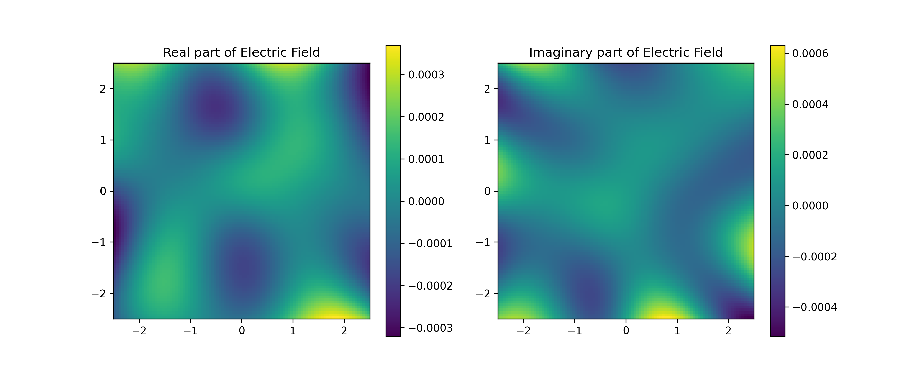
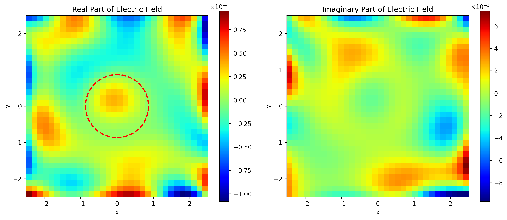

# 📘 电磁逆散射模拟教程

本教程演示如何使用物理信息神经网络（PINN）模拟电磁波在二维区域内的传播与逆散射过程，基于 PyTorch 实现。通过不同网络结构和损失项设计，分别解决正问题（已知介质求电场）与逆问题（已知电场推断介电常数与目标区域）的建模任务。

---

## 1️⃣ 问题背景
### 🎯 场景实例化

在雷达成像与非破坏性检测等电磁反演应用中，往往需要识别目标物体在自由空间中的分布与介电特性。常见任务包括：

- **目标识别**：判断区域内是否存在电磁异常区域（如地下金属/隐伏矿体）
- **参数反演**：推断目标介电常数($\varepsilon$)和几何轮廓

为此，我们考虑如下二维仿真场景：

- 外部施加时谐电场源
- 区域中心可能包含一个未知介质目标
- 目标外设有吸收边界（PML）避免反射干扰
- 观测目标区域内的电场响应以反推出目标特性

---

## 2️⃣ 数学物理模型

### ⚡ 2.1 麦克斯韦方程组（简化形式）

我们考虑时谐场 ($\exp(-i\omega t)$ 形式)，在无源、各向同性介质中，麦克斯韦方程可简化为**亥姆霍兹方程**：

$$
\nabla^2 E + k^2 \varepsilon E = 0
$$

其中：

- $E$：复数电场（$E = E_r + i E_i$）
- $k = \dfrac{2\pi}{\lambda}$：波数
- $\varepsilon$：介电常数

---

### 🧱 2.2 吸收边界条件：PML 层建模

为避免反射，我们在边界添加完全匹配层（Perfectly Matched Layer, PML），等效于复坐标伸缩变换：

$$
\frac{d}{dx} \to \frac{1}{s_x} \frac{d}{dx}, \quad \frac{d}{dy} \to \frac{1}{s_y} \frac{d}{dy}
$$

其中 $s_x(x), s_y(y)$ 为复系数函数，常采用如下形式：

$$
s_x(x) = 1 + \frac{\sigma_x(x)}{i\omega\varepsilon_0}, \quad \sigma_x(x) = \sigma_{\max} \left(\frac{x - x_b}{L}\right)^n
$$

边界吸收由 $\sigma$ 控制，$n=2$ 或 $n=3$。

---

### 🧱 2.3 边界条件

对于电磁散射反演问题，常采用如下辐射边界条件近似：

$$
\frac{\partial E}{\partial n} + i k E = 0 \quad \text{on } \partial\Omega
$$

---

## 3️⃣ 模型一：正问题求解（pytorchES.py）

### 🧪 模拟内容

- 几何区域：矩形区域 $\Omega$，四周加 PML 吸收层
- 固定介电常数：$\varepsilon = 4.0$
- 电场变量为复数，实部与虚部分开建模

### 🔢 神经网络结构

- 输入维度：$(x, y)$
- 输出维度：$(E_r, E_i)$
- 网络结构：5 层全连接，每层 50 个神经元

### ⚙️ PDE 残差定义

电场满足复亥姆霍兹方程，我们分别对实部和虚部建立残差：

$$
\text{Res}_r = \nabla \cdot (\sigma \nabla E_r) - k^2 \varepsilon E_r \\
\text{Res}_i = \nabla \cdot (\sigma \nabla E_i) - k^2 \varepsilon E_i
$$

其中 $\sigma$ 来源于 PML 系数。

### 🎯 损失函数

仅包含 PDE 残差平方项：

$$
\mathcal{L} = \text{MSE}(\text{Res}_r) + \text{MSE}(\text{Res}_i)
$$

---

## 4️⃣ 模型二：电磁逆散射反演（pytorchEIS.py）

### 🧪 模拟内容

- 区域 $\Omega$ 中心为未知目标圆域 $D$
- 电场分布已知，推断 $D$ 的介电常数 $\varepsilon$ 与半径 $R$
- 排除目标区域 $D$ 的训练点

### 🔢 神经网络结构

- 输入维度：$(x, y)$
- 输出维度：$(\tilde{E}_r, \tilde{E}_i)$
- 经过变换层 `transform_inverse` 恢复 $E$

### 🧮 PDE 与边界残差定义

- **PDE 残差** 同样源自亥姆霍兹方程：

$$
\text{Res}_r = \nabla \cdot (\sigma \nabla E_r) - k^2 \varepsilon(x,y) E_r \\
\text{Res}_i = \nabla \cdot (\sigma \nabla E_i) - k^2 \varepsilon(x,y) E_i
$$

- **边界残差** 施加辐射边界条件：

$$
\text{BC} = \frac{\partial E}{\partial n} + i k E
$$

### 🎯 总损失函数

PDE + 边界条件加权组合：

$$
\mathcal{L} = \text{MSE}(\text{Res}_r) + \text{MSE}(\text{Res}_i) + 0.1 \cdot \text{MSE}(\text{BC})
$$

---

## 5️⃣ 实验结果（pytorchEIS.py）

最终反演得到目标区域的参数为：

- 半径：$R = 0.3599$
- 介电常数：$\varepsilon = 1.9440$

---

## 6️⃣ 模型对比分析

| 模型 | pytorchES（正问题） | pytorchEIS（逆问题） |
|------|---------------------|----------------------|
| 区域建模 | 简单矩形 + PML | 圆形目标 + PML |
| 可训练参数 | 电场分布 | 电场分布 + $\varepsilon$ |
| 边界处理 | 无边界条件 | 强化边界残差 |
| 优化器 | Adam + L-BFGS | Adam + LR 调度 |
| 损失项 | PDE | PDE + 边界条件 |
| 计算效率 | 快速 | 显著更慢 |
| 适用场景 | 快速求解场 | 高精度反演 |

---

## 7️⃣ 可视化结果

### 📊 模型一：正问题求解（pytorchES.py）

下图展示了固定介电常数 $\varepsilon = 4.0$ 条件下，复电场的实部与虚部分布图：



- **左图**：电场实部 $\Re(E)$  
- **右图**：电场虚部 $\Im(E)$  
- 无目标物体存在，场分布光滑，近似均匀

---

### 📊 模型二：逆散射反演（pytorchEIS.py）

下图展示了在存在散射目标的情况下，PINN 模型反演得到的电场分布。红色虚线圆为模型识别出的目标区域：



- **左图**：$\Re(E)$ 在中心明显存在场扰动，反映出目标物体的电磁影响  
- **右图**：$\Im(E)$ 表现出更显著的相位扰动  
- 圆形红圈为识别出的目标（$R = 0.3599$, $\varepsilon = 1.944$）

---

> ✅ 请确保运行脚本后生成的图片保存在 `viz/` 文件夹下，Markdown 路径引用需保持一致。

## 🔚 总结建议

- 若目标是验证电磁传播或构建初步物理场模型，可采用 **pytorchES**；
- 若任务是识别隐伏目标、电磁成像、介电特性重建等高精度应用，推荐使用 **pytorchEIS**；

---


## ▶️ 快速运行

```bash
# 正问题（固定介电常数）
python pytorchES.py

# 逆问题（反演介电常数）
python pytorchEIS.py
```
