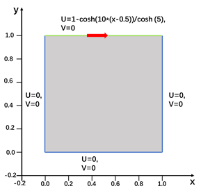
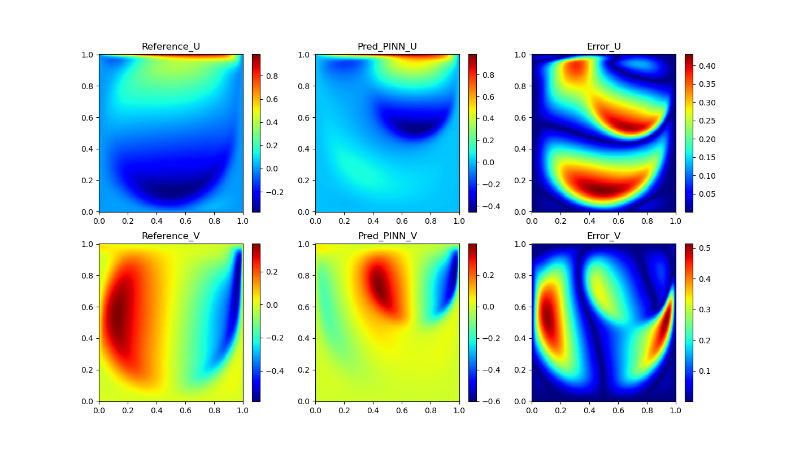
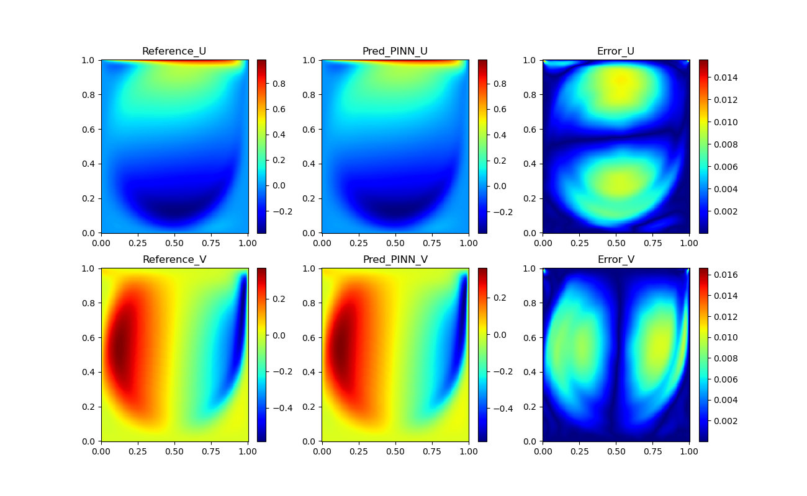

# PIKAN用于求解方腔流问题

该目录下一共有两个文件夹，分别是ev_NSKANet;NSKANet

ev_NSKANet，使用KAN神经网络来构成PIKANs用于求解方腔流问题

NSKANet，使用人工粘性的PIKANs用于求解方腔流问题

## 介绍

本教程将引导您完成如何使用PIKAN来实现对高雷诺数问题的求解

1、如何编写自己的偏微分如何编写自己的偏微分方程的条件
2、如何设置自己的求解参数
3、如何将自己的求解结果进行输出用于结果的后处理

## PIKAN

### PIKAN求解示意图

PINN和PIKAN的区别在于PINN使用的MLP全连接神经网络;而PIKAN使用的是KAN网络

## 问题描述

### 物理问题的描述

顶盖驱动空腔是计算流体力学（CFD）领域用于验证计算方法的常用问题之一。虽然涉及的边界条件相对简单，但是流动特性却相当复杂有趣。顶盖驱动空腔包含一个充满液体的方形空腔。在顶部边界处，切向速度被用来驱动空腔内的流体流动。剩余的三个壁被定义为无滑移边界条件，即速度为零。
动量守恒方程

$$
(\mathbf{u} \cdot \nabla) \mathbf{u} = -\nabla p + \frac{1}{\mathrm{Re}} \nabla^2 \mathbf{u} \text{, in } \Omega
$$

质量守恒方程

$$
\nabla\cdot\mathbf{u}=0,\quad\mathrm{in~}\Omega
$$

边界条件

其中有一些主要的参数，雷诺数Re。

### 二维稳态盖驱动方腔流问题的边界条件的定义



## 导入所需要的包

本文件夹中的py文件是缺一不可得，所有的py文件的编写是基于pytorch框架。
一共有五个py文件。其中运行的主文件是train.py;cavity_data.py文件是训练数据和验证数据提供程序；net.py是网络设置程序，使用全连接神经网络MLP；pinn_solver.py是设置设置物理损失和边界损失的程序；tools.py是拉丁超立方体采样方式；

需要的环境是python>=3.9,pytorch>=2.0;需要安装的Python包见requirement.txt文件

## train.py

```python
import cavity_data as cavity
import pinn_solver as psolver #导包
```

```python
if __name__ == "__main__":
    for loop in range(0, 1): #设置循环次数
        train(loop=loop)
```

使用人工粘性的设置

```python
epoch=300000 #训练步数
    PINN.set_alpha_evm(0.05) #人工粘性参数设置
    PINN.train(num_epoch=epoch, lr=1e-3)
    PINN.test(x_star, y_star, u_star, v_star, t_star, 300000, loop)
```

不使用人工粘性的设置

```python
epoch=300000
    PINN.train(num_epoch=epoch, lr=1e-3)
    PINN.test(x_star, y_star, u_star, v_star, t_star, 300000, loop)
```

其他注释见train.py文件

## cavity_data.py

导包

```python
import numpy as np
    import scipy.io
    from tools import LHSample
    from tools import sort_pts
```

边界/初始条件

```python
def loading_boundary_data(self):
        ...
        return x_b, y_b, u_b, v_b, t_b 
```内部采点
```python
    def loading_training_data(self):
        ...
        return x_train_f, y_train_f
```

测试数据

```python
def loading_evaluate_data(self, filename):
        ...
        return x_star, y_star, u_star, v_star, p_star, t_star
```

其他注释见cavity_data.py文件

## net.py

导包

```python
import torch
    from collections import OrderedDict
```

```python
from kan import KAN   #使用KAN来求解
```

构建KAN网络模型

```python
class ChebyKANLayer(nn.Module):
       def __init__(self, input_dim, output_dim, degree):
          ...
       def forward(self, x):
          ...
    class ChebyKAN(nn.Module):
       def __init__(self):
          ...
       def forward(self, x):
          ...
```

根据自己的需求构建KAN网络，可以是多个

## pinn_solver.py

导包

```python
import os
    import torch
    import scipy.io
    import numpy as np
    from net import FCNet
    from from net import ChebyKAN
    from net import ChebyKAN_1
    from net import ChebyKAN_2
    from typing import Dict, List, Set, Optional, Union, Callable
```

设置设备

```python
device = torch.device("cuda" if torch.cuda.is_available() else "cpu")
```

**PINNs 中增加人工粘性需要增添的部分**

```python
self.vis_t0 = 5.0/self.Re
```

```python
def init_vis_t(self):
        """
        初始化人工粘性相关参数
        """
        (_,_,_,e) = self.neural_net_u(self.x_f, self.y_f)
        self.vis_t_minus  = self.alpha_evm*torch.abs(e).detach().cpu().numpy()
```

```python
def set_alpha_evm(self, alpha):
        """
        设置人工粘性相关参数。
        """
        self.alpha_evm = alpha
```

```python
def neural_net_equations(self, x, y):
        ...
        # Get the minum between (vis_t0, vis_t_mius(calculated with last step e))
        self.vis_t = torch.tensor(
                np.minimum(self.vis_t0, self.vis_t_minus)).float().to(device)
        self.vis_t_minus  = self.alpha_evm*torch.abs(e).detach().cpu().numpy()
        # NS
        eq1 = (u*u_x + v*u_y) + p_x - (1.0/self.Re+self.vis_t)*(u_xx + u_yy)
        eq2 = (u*v_x + v*v_y) + p_y - (1.0/self.Re+self.vis_t)*(v_xx + v_yy)
        eq3 = u_x + v_y
        residual = (eq1*(u-0.5)+eq2*(v-0.5))-e
    
        return eq1, eq2, eq3, residual
```

```python
def solve_Adam(self,
                   loss_func,
                   num_epoch=1000,
                   batchsize=None,
                   scheduler=None):
        self.freeze_evm_net(0)
        for epoch_id in range(num_epoch):
            # train evm net every 10000 step
            if epoch_id !=0 and epoch_id % 10000 == 0:
                self.defreeze_evm_net(epoch_id)
            if (epoch_id - 1) % 10000 == 0:
                self.freeze_evm_net(epoch_id)
            ···
```

```python
def freeze_evm_net(self, epoch_id):
        """
        设置对神经网络的冻结
        """
        for para in self.net_1.parameters():
            para.requires_grad = False
        self.opt.param_groups[0]['params'] = list(self.net.parameters())


    def defreeze_evm_net(self, epoch_id):
        """
        设置对神经网络的解冻
        """
        for para in self.net_1.parameters():
            para.requires_grad = True
        self.opt.param_groups[0]['params'] = list(self.net.parameters()) + list(self.net_1.parameters()) + list(self.net_2.parameters())
```

其他注释见pinns_solver.py文件

## tool.py

用于实现二维的拉丁超立方采样

```python
import math
    import numpy as np
```

## PINN功能介绍

### 参数的设置

PINN的参数设置主要是通过train.py文件进行实现，这其中包括雷诺数的设置，普朗特数的设置，神经网络的层数等参数

```python
def train(net_params=None, loop=None):
        Re = 2000 # Reynolds number
        lam_bcs = 10 #边界loss的权重
        lam_equ = 1  #方程loss的权重
        N_f = 40000 #内部采样点个数
        N_b = 2500 #边界采样点个数
        loop=loop #遍历的次数
        ...
        filename = './data/cavity_Re'+str(Re)+'_256.mat'
        x_star, y_star, u_star, v_star = dataloader.loading_evaluate_data(filename)
        # Training
         start_time = time.time()
        epoch = 100000
        PINN.set_alpha_evm(0.05)
        PINN.train(num_epoch=epoch, lr=1e-3, label=100000)
        PINN.test(x_star, y_star, u_star, v_star, 100000, loop)
```

PINN.train()   #调用pinn_slover.py中的def train():实现对PINN的训练
PINN.test()    #调用pinn_slover.py中的def test():实现对PINN输出结果的评估并保存计算结果

### 损失的构建

损失包括边界条件的损失和方程的损失，损失的构建全部是在pinn_solver.py中实现
边界条件的损失,可以使用的构建方式有两种，一种是L2，一种是MSE

```python
def fwd_computing_loss_2d(self, loss_mode='MSE'):
        # boundary data
        (self.u_pred_b, self.v_pred_b, _) = self.neural_net_u(self.x_b, self.y_b)
        # (self.u_pred_b, self.v_pred_b, _, _) = self.neural_net_u(self.x_b, self.y_b)
        # 使用self.neural_net_u(),得到边界点的输出
        # BC loss 边界的损失
        if loss_mode == 'L2':
            self.loss_b = torch.norm((self.u_b.reshape([-1]) - self.u_pred_b.reshape([-1])), p=2) + \
                          torch.norm((self.v_b.reshape([-1]) - self.v_pred_b.reshape([-1])), p=2) 
        if loss_mode == 'MSE':
            self.loss_b = torch.mean(torch.square(self.u_b.reshape([-1]) - self.u_pred_b.reshape([-1]))) + \
                          torch.mean(torch.square(self.v_b.reshape([-1]) - self.v_pred_b.reshape([-1])))
```

方程的构建,可以使用的构建方式有两种，一种是L2，一种是MSE
使用人工粘性

```python
(self.eq1_pred, self.eq2_pred,
         self.eq3_pred, self.eq4_pred) = self.neural_net_equations(self.x_f, self.y_f)

        if loss_mode == 'L2':
            self.loss_e = torch.norm(self.eq1_pred.reshape([-1]), p=2) + \
                  torch.norm(self.eq2_pred.reshape([-1]), p=2) + \
                  torch.norm(self.eq3_pred.reshape([-1]), p=2) + \
                  torch.norm(self.eq4_pred.reshape([-1]), p=2)
        if loss_mode == 'MSE':
            self.loss_eq1 = torch.mean(torch.square(self.eq1_pred.reshape([-1])))
            self.loss_eq2 = torch.mean(torch.square(self.eq2_pred.reshape([-1])))
            self.loss_eq3 = torch.mean(torch.square(self.eq3_pred.reshape([-1])))
            self.loss_eq4 = torch.mean(torch.square(self.eq4_pred.reshape([-1])))
            self.loss_e = self.loss_eq1 + self.loss_eq2 + self.loss_eq3 + self.loss_eq4
```

不使用人工粘性

```python
(self.eq1_pred, self.eq2_pred,
         self.eq3_pred) = self.neural_net_equations(self.x_f, self.y_f)

        if loss_mode == 'L2':
            self.loss_e = torch.norm(self.eq1_pred.reshape([-1]), p=2) + \
                  torch.norm(self.eq2_pred.reshape([-1]), p=2) + \
                  torch.norm(self.eq3_pred.reshape([-1]), p=2)
        if loss_mode == 'MSE':
            self.loss_eq1 = torch.mean(torch.square(self.eq1_pred.reshape([-1])))
            self.loss_eq2 = torch.mean(torch.square(self.eq2_pred.reshape([-1])))
            self.loss_eq3 = torch.mean(torch.square(self.eq3_pred.reshape([-1])))
            self.loss_e = self.loss_eq1 + self.loss_eq2 + self.loss_eq3
```

上面的损失对应的是每一个方程

```python
# 总损失
        self.loss = self.alpha_b * self.loss_b + self.alpha_e * self.loss_e
        return self.loss, [self.loss_e, self.loss_b]
```

### 创建输入和节点

输入部分是使用cavity_data.py,这里包括边界条件的输入，内部残差点的输入，测试点和真实数据的输入

```python
def __init__(self, path=None, N_f=20000, N_b=1000):
        ...
```

N_f: 残差点的数量; N_b: 边界点的数量

```python
def loading_boundary_data(self):
        ...
        return x_b, y_b, u_b, v_b
```

定义边界的约束，分别是边界的X,Y坐标值，对应下的边界上的速度u,v,t

```python
def loading_training_data(self):
        ...
        return x_train_f, y_train_f
```

输入残差点的坐标，分别输入的是X和Y的值

```python
def loading_evaluate_data(self, filename):
        ...
        return x_star, y_star, u_star, v_star, p_star
```

添加验证数据，输入数值方式的得到的真实解，用于对PINNs计算的结果进行评价。

### 输出并保存数据结果文件

此功能实现是依赖pinn_solver.py文件

```python
def test(self, x, y, u, v, p, num_epoch, loop=None):
        ...
```

上面的功能是实现对PINN的输出结果与真实结果之间计算L2误差，同时保存计算结果到.mat用于后处理

## PIKAN的功能介绍

### 参数设置

PIKAN和PINN参数设计不同之处是神经网络参数层数和神经元节点个数的设计

```python
class ChebyKAN(nn.Module):
    def __init__(self):
        super(ChebyKAN_1, self).__init__()
        self.chebykan1 = ChebyKANLayer(2, 32, 8)
        self.chebykan2 = ChebyKANLayer(32, 32, 8)
        self.chebykan3 = ChebyKANLayer(32, 3, 8)
    def forward(self, x):
        x = self.chebykan1(x)
        x = self.chebykan2(x)
        x = self.chebykan3(x)
        return x
```

PIKAN的设置是在net.py文件中实现的。在上面的设置中输入是二维，输出是三维的，网络设置三层，神经元的个数是32个。

## 结果展示

### PIKAN结果展示

#### 原始PIKAN结果展示


针对Re=2000的参数得出求解结果，图中最左边CFD的是直接数值模拟提供的参考结果 ，图中间的是原始PIKAN提供的结果
，图最右边的是误差分布结果

针对Re=2000的参数得出求解结果，图中最左边CFD的是直接数值模拟提供的参考结果 ，图中间的是人工粘性PIKAN提供的结果
，图最右边的是误差分布结果

具体结果看下面的表格


