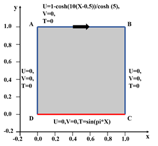
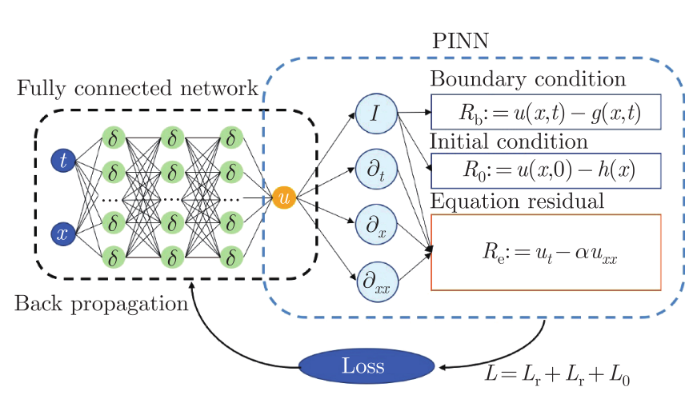

# PINNs用于求解对流传热问题
## 介绍
本教程将引导您完成如何使用PINNs来实现对强迫对流传热问题的求解，了解对流传热问题的相关问题，在本教程中，您将学习到以下的内容  
1、如何编写自己的偏微分如何编写自己的偏微分方程的条件  
2、如何设置自己的求解参数  
3、如何将自己的求解结果进行输出用于结果的后处理

## 问题描述
### 物理问题的描述
对流传热是指热量通过流体（液体或者气体）传递的过程。在这个过程中，
热量是通过流体进行传递而不是直接通过导体或辐射的方式。
对流传热可以通过两种主要方式发生：强迫对流和混合对流。
对流传热过程的准确模拟对这些领域的发展具有重要的意义。
流动与传热问题中的偏微分方程主要是Navier-Stokes和能量守恒方程。

（1）和（3）共同组成NS方程，（2）是传热方程。其中有一些主要的参数，雷诺数Re，普朗特数Pr，Pe是贝克来数。Pe
=Ri*Pr。 Ri是理查森数。 Ri=0表示的是强迫对流传热，当Ri不等于0时表示的是混合对流传热。
### 强迫对流传热问题

### 混合对流传热问题

### PINNs求解示意图

## 导入所需要的包
本文件夹中的py文件是缺一不可得，所有的py文件的编写是基于pytorch框架。一共有五个py文件。
其中运行的主文件是train.py;
cavity_data.py文件是训练数据和验证数据提供程序；
net.py是网络设置程序，使用全连接神经网络MLP；
pinn_solver.py是设置设置物理损失和边界损失的程序；
tools.py是拉丁超立方体采样方式；
## train.py
```python
import cavity_data as cavity
import pinn_solver as psolver #导包
```
```python
if __name__ == "__main__":
    for loop in range(0, 1): #设置循环次数
        train(loop=loop)
```


## 编写自定义偏微分方程和边界/初始条件

## 案例设置

## 创建输入和节点
## 创建几何图形和添加约束
## 从分析方案中添加验证数据
## 结果展示