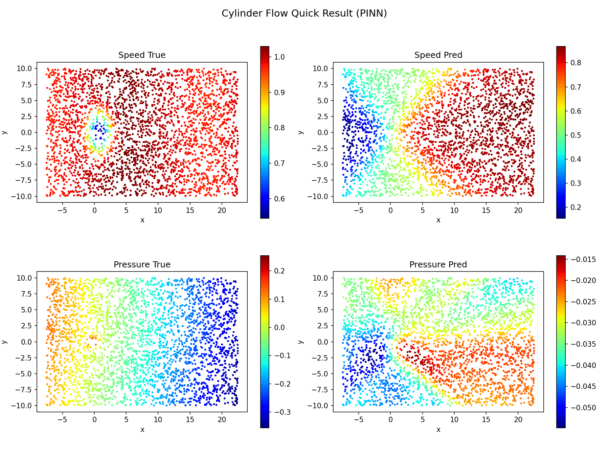
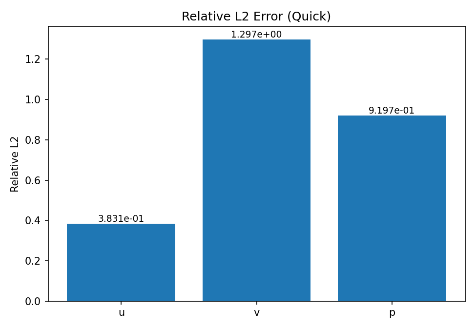

<!--
text: "CylinderFlowPINN：二维圆柱绕流瞬态流场物理建模"
area: "本案例基于物理信息神经网络（PINN）求解二维不可压缩圆柱绕流（Re=100）瞬态速度-压力场，覆盖方程约束、分时窗训练、误差评估与工程化解读。"
tags: ["基础算法", "流体力学", "PINN", "Navier-Stokes", "圆柱绕流", "瞬态求解"]
search: ["圆柱绕流", "PINN", "Re100", "不可压缩Navier-Stokes", "流场重建"]
-->

# CylinderFlowPINN：二维圆柱绕流瞬态流场（PINN）


## 快速使用

您可跳转[使用示例](#使用示例)查看如何使用秋月白平台快速执行该类问题，以下是实现逻辑详解。

---

## 项目概述

圆柱绕流是流体力学中的经典基准问题之一。它兼具以下特点：

- 几何简单但流动机理丰富（边界层、分离、尾迹、涡脱落）。
- 既可作为算法验证基准，也与工程问题高度相关（外流噪声、载荷波动、换热强化、振动风险）。
- 在 Re=100 等中低雷诺数区间，既存在明显非定常行为，又能保持可控的数值复杂度。

本案例采用 PINN（Physics-Informed Neural Networks）方法，在无网格采样点上联合约束：

- Navier-Stokes 动量守恒
- 不可压缩连续性
- 初始条件
- 边界与出口条件

并通过分时间窗口滚动训练策略，提高长时序瞬态预测稳定性。

---

## 背景介绍

传统 CFD 方法（有限体积/有限元/谱方法）在圆柱绕流求解中性能稳定，但在以下场景常面临成本与灵活性挑战：

- 多工况参数扫描（Re、入口速度、几何参数）
- 边界条件频繁变更
- 稀疏观测数据同化与反推
- 与下游代理模型或实时系统的耦合

PINN 的优势在于将物理方程直接注入损失函数，能够在点云上进行无网格训练，具备更强的“物理可泛化性”。在本案例中，PINN 并非完全替代 CFD，而是作为：

- 快速重建与预测工具
- 物理一致的代理模型
- 多工况迭代中的加速器

---

## 原理介绍

### 1. 输入输出映射

网络输入：

$$
(t, x, y)
$$

网络输出：

$$
(u, v, p)
$$

其中：

- $u, v$ 分别为 $x/y$ 方向速度
- $p$ 为压力

此外，案例中额外设置了一个辅助网络分支输出 $e$，用于构建附加残差项，提升训练稳定性与误差控制能力。

### 2. 自动微分构造物理残差

通过 `torch.autograd.grad` 自动计算一阶、二阶导数：

- $u_t, u_x, u_y, u_{xx}, u_{yy}$
- $v_t, v_x, v_y, v_{xx}, v_{yy}$
- $p_x, p_y$

再代入控制方程残差，与初值/边界约束共同构成总损失。

### 3. 分时窗滚动训练

本案例将完整时域拆为多个窗口，按序训练：

- $[1,10]$
- $[11,20]$
- $[21,30]$
- $[31,40]$
- $[41,50]$

每个窗口训练完成后，用当前窗口末状态构造下一窗口初值，实现时间推进式学习，缓解“长时域一次性训练”带来的优化困难。

---

## 创新点

- **物理残差驱动的无网格流场建模**  
  不依赖传统网格离散，在点采样基础上直接最小化 PDE 残差。

- **主网络 + 辅助网络双分支结构**  
  主网络学习 $(u,v,p)$，辅助分支学习附加残差相关量 $e$，提升非定常流场的拟合稳定性。

- **分时窗滚动策略增强长时序稳定性**  
  通过窗口接力训练降低长期误差累积，提升跨时间区间预测连续性。

- **兼顾物理一致性与数据监督**  
  支持结合观测/仿真数据进行评估，形成“方程 + 数据”双重校验闭环。

---

## 1、控制方程

### 1.1 二维不可压缩 Navier-Stokes 方程

在无量纲形式下，设雷诺数为 $Re$，动力粘性项系数为 $1/Re$，则动量方程为：

$$
\begin{aligned}
\frac{\partial u}{\partial t}
+ u\frac{\partial u}{\partial x}
+ v\frac{\partial u}{\partial y}
+ \frac{\partial p}{\partial x}
- \left(\frac{1}{Re}+\nu_t\right)\left(\frac{\partial^2 u}{\partial x^2}+\frac{\partial^2 u}{\partial y^2}\right)
=0,\\
\frac{\partial v}{\partial t}
+ u\frac{\partial v}{\partial x}
+ v\frac{\partial v}{\partial y}
+ \frac{\partial p}{\partial y}
- \left(\frac{1}{Re}+\nu_t\right)\left(\frac{\partial^2 v}{\partial x^2}+\frac{\partial^2 v}{\partial y^2}\right)
=0.
\end{aligned}
$$

其中 $\nu_t$ 为基于辅助分支生成的附加粘性调制项（代码中由 `alpha_evm` 与 $e$ 构造）。

### 1.2 连续性方程

$$
\frac{\partial u}{\partial x} + \frac{\partial v}{\partial y}=0.
$$

### 1.3 初始条件与边界条件（典型）

- 初始条件：$t=t_0$ 时给定 $(u,v,p)$ 或其子集。
- 壁面边界：无滑移条件 $u=v=0$（对应圆柱壁面与相关固壁）。
- 出口边界：压力或速度导数条件（代码中通过出口采样点与损失项处理）。

### 1.4 残差定义（与代码对应）

在 `pinn_solver.py` 中，动量与连续性残差可抽象写为：

$$
\begin{aligned}
r_u &= u_t + uu_x + vu_y + p_x - (1/Re+\nu_t)(u_{xx}+u_{yy}),\\
r_v &= v_t + uv_x + vv_y + p_y - (1/Re+\nu_t)(v_{xx}+v_{yy}),\\
r_c &= u_x + v_y.
\end{aligned}
$$

附加残差项（代码中 `residual = (eq1*(u-0.5)+eq2*(v-0.5))-e`）用于耦合辅助网络输出并增强约束表达。

---

## 1.5 总损失函数

可表示为：

$$
L_{total} = \lambda_{eq}L_{eq}+\lambda_{bc}L_{bc}+\lambda_{ic}L_{ic}+\lambda_{out}L_{out}+\lambda_{aux}L_{aux}.
$$

其中：

$$
\begin{aligned}
L_{eq}&=\frac{1}{N_f}\sum_{i=1}^{N_f}\left(r_u^2+r_v^2+r_c^2\right)_i,\\
L_{bc}&=\frac{1}{N_b}\sum_{i=1}^{N_b}\left(\|u-u_b\|^2+\|v-v_b\|^2\right)_i,\\
L_{ic}&=\frac{1}{N_{ic}}\sum_{i=1}^{N_{ic}}\left(\|u-u_0\|^2+\|v-v_0\|^2+\|p-p_0\|^2\right)_i,\\
L_{out}&=\frac{1}{N_{out}}\sum_{i=1}^{N_{out}}\left(\|p-p_{out}\|^2\right)_i.
\end{aligned}
$$

`L_aux` 为辅助分支相关项（按实现可并入 `L_eq` 或独立设置权重）。

---

## 2、参数、属性定义（核心参数）

### 2.1 物理参数

| 参数 | 含义 | 典型值 |
|---|---|---|
| $Re$ | 雷诺数 | 100 |
| $\nu$ | 分子粘性系数（无量纲） | $1/Re$ |
| $\nu_t$ | 辅助附加粘性项 | 由模型动态给定 |

### 2.2 网络参数（代码默认）

| 参数 | 含义 | 默认值 |
|---|---|---|
| `layers` | 主网络隐藏层层数 | 6 |
| `hidden_size` | 主网络隐藏层宽度 | 120 |
| `layers_1` | 辅助网络隐藏层层数 | 6 |
| `hidden_size_1` | 辅助网络隐藏层宽度 | 20 |

### 2.3 训练参数（代码默认）

| 参数 | 含义 | 默认值 |
|---|---|---|
| `N_train` | 方程点数 | 15000 |
| `N_b` | 边界点数 | 4096 |
| `lam_equ` | 方程损失权重 | 10 |
| `lam_bcs` | 边界损失权重 | 10 |
| `lam_ic` | 初值损失权重 | 10 |
| `alpha_evm` | 辅助粘性比例参数 | 0.03~0.05 |
| `lr` | 学习率 | 1e-3 |
| `num_epoch` | 单窗口训练轮次 | 50000 |

### 软件版本要求

建议 Python 3.8 及以上。

### 所需核心库

```python
import numpy as np
import torch
import matplotlib.pyplot as plt
import scipy
```

---

## 3、计算方法及代码实现

### 3.1 神经网络结构

- `net.py` 定义全连接网络 `FCNet`
- `pinn_solver.py` 中初始化两个网络：
  - `self.net`：输出 $(u,v,p)$
  - `self.net_1`：输出 $(e)$

激活函数采用 `Tanh`，利于光滑场与高阶导数自动微分。

### 3.2 数据流

`cylinder_re100_data.py` 负责：

- 读取 `datasets/cylinder_nektar_Re100.mat`
- 采样边界点、内部方程点、出口点
- 提供初值数据与评估快照数据
- 组织时间窗口索引与滚动训练所需接口

### 3.3 训练主流程（train.py）

训练过程核心步骤：

1. 初始化 PINN 与参数
2. 读取评估数据快照
3. 设置第一时间窗
4. 设定初值 / 边界 / 出口 / 方程点
5. 执行训练并保存 checkpoint
6. 由当前窗口结果构造下一窗口初值
7. 重复直到覆盖全部时间窗

### 3.4 测试流程（test.py）

测试脚本支持：

- 加载训练权重
- 在指定时间窗进行全场推理
- 输出相对误差（`u/v/p`）
- 可选导出 VTK 或动画（按脚本开关）

---

## 4、模型高精度训练建议

### 4.1 采样策略建议

- 边界层与尾迹区域可增加采样密度。
- 圆柱近壁与分离区建议采用局部加密。
- 不同时间窗可采用不同采样规模，以平衡精度与效率。

### 4.2 权重平衡建议

- 初期：提高 `lam_bcs/lam_ic`，先学会边界与初始物理约束。
- 中后期：提升 `lam_equ`，强化 PDE 一致性。
- 若出现过平滑：降低 `alpha_evm` 或辅助项权重，避免过强扩散效应。

### 4.3 优化稳定性建议

- 学习率从 `1e-3` 起，视损失震荡情况逐步衰减。
- 每个时间窗训练后进行快照评估，监控窗口间误差漂移。
- 保持 checkpoint 周期化保存，便于回退与对比。

---

## 5、预测、绘图及成果展示

### 5.0 快速模式结果图（本地实测）

下图来自当前工程 quick 模式运行产物：



图中展示了：
- 速度模长真值与预测对比（Speed True vs Speed Pred）
- 压力场真值与预测对比（Pressure True vs Pressure Pred）

对应误差柱状图如下：



> 说明：若图片未显示，请先运行 `python main.py --mode quick --data simul` 重新生成结果文件。

### 5.1 误差指标

推荐同时报告：

- 相对 $L_2$ 误差：$u,v,p$
- 窗口末时刻误差
- 全窗口平均误差
- 局部区域误差（如尾迹区 ROI）

### 5.2 可视化建议

- 速度标量场：$u$ / $v$
- 压力场：$p$
- 矢量流线：速度矢量场
- 时序动画：展示尾迹演化与涡结构迁移

### 5.3 结果解读要点

- 迎风面压力峰值与背风面低压区是否合理。
- 圆柱后方尾迹是否出现预期速度亏损与非定常结构。
- 窗口衔接处是否连续，是否存在明显跳变。

---

## 6、常见问题（FAQ）

### Q1：训练不收敛怎么办？

- 检查数据文件路径是否正确：`datasets/cylinder_nektar_Re100.mat`
- 降低学习率，先保证 `L_bc/L_ic` 稳定下降
- 检查采样点是否覆盖关键区域（圆柱近壁、尾迹区）

### Q2：边界满足不好怎么办？

- 提高 `lam_bcs`
- 增加 `N_b`
- 检查边界点标签与采样是否正确

### Q3：长时序误差累积明显怎么办？

- 缩小单个时间窗跨度
- 增加窗口过渡约束
- 对窗口末状态使用更严格筛选后再传递

### Q4：预测场过于平滑怎么办？

- 降低 `alpha_evm`
- 适度减小辅助分支影响
- 提高关键区域点密度

---

## 7、工业价值

- **流场快速重建**：在多工况分析中提供更快的近实时流场估计。
- **设计迭代加速**：用于外形优化前筛选，提高方案探索效率。
- **风险早筛**：对尾迹、压力脉动、可能振动风险区域进行先验评估。
- **仿真-数据融合**：可进一步结合实验数据做物理一致的补偿与重建。

---

## 8、使用示例

### A. 训练

```bash
cd C:\Users\se42\Desktop\案例\PINN4Science\Fluid_Mechanics\cylinder_flow
python train.py
```

### B. 测试

```bash
cd C:\Users\se42\Desktop\案例\PINN4Science\Fluid_Mechanics\cylinder_flow
python test.py
```

如需切换测试模型路径，请修改 `test.py` 末尾：

```python
net_params = 'checkpoint/net_params_40000.pth'
```

---

## 9、文件结构（当前实现）

```text
cylinder_flow/
├── geometry/                     # 几何资源
├── new_cylinder_flow/            # 历史/扩展目录
├── cylinder_re100_data.py        # 数据加载与采样
├── net.py                        # 网络结构
├── pinn_solver.py                # PINN 方程与训练逻辑
├── train.py                      # 训练入口
├── test.py                       # 测试入口
└── README.md                     # 案例文档
```

---

## 10、附：关键代码片段（示意）

### 10.1 PDE 残差构造（示意）

```python
# eq1: x-momentum, eq2: y-momentum, eq3: continuity
eq1 = (u * u_x + v * u_y) + p_x - (1.0/Re + vis_t) * (u_xx + u_yy) + u_t
eq2 = (u * v_x + v * v_y) + p_y - (1.0/Re + vis_t) * (v_xx + v_yy) + v_t
eq3 = u_x + v_y
```

### 10.2 总损失（示意）

```python
loss = lam_equ * loss_equ + lam_bcs * loss_bc + lam_ic * loss_ic + lam_out * loss_out
```

### 10.3 分时窗训练（示意）

```python
for time_range in [[1,10], [11,20], [21,30], [31,40], [41,50]]:
    dataloader.set_time_range(time_frames=10, time_range=time_range)
    PINN.set_initial_data(X=current_ic)
    PINN.set_boundary_data(X=boundary_data)
    PINN.set_outlet_data(X=outlet_data)
    PINN.set_eq_training_data(X=training_data)
    PINN.train(num_epoch=50000, lr=1e-3)
    current_ic = PINN.prepare_next_ic(...)
```

---

## 贡献与许可证

**贡献者：** Se42 团队及案例维护者。  
**许可证：** 请以仓库内源文件头部声明与项目整体许可证为准。
