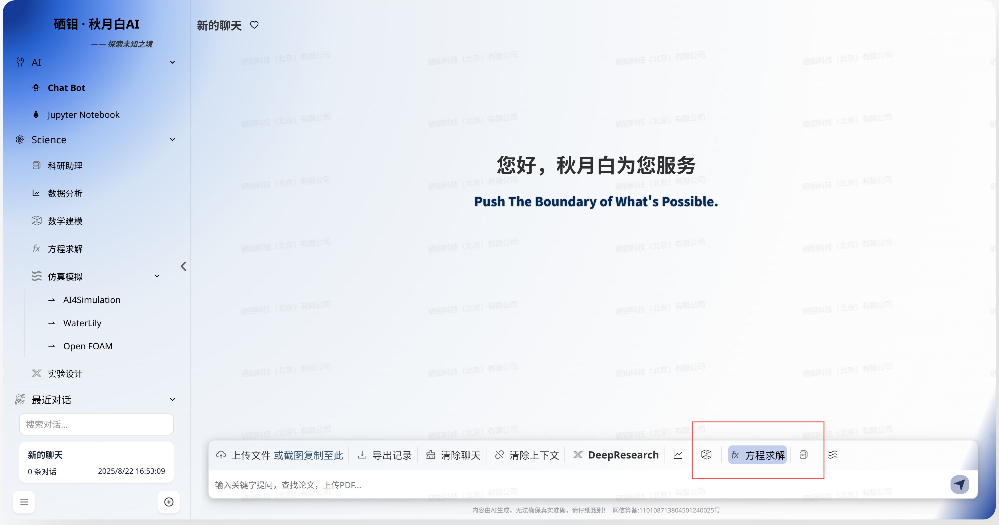
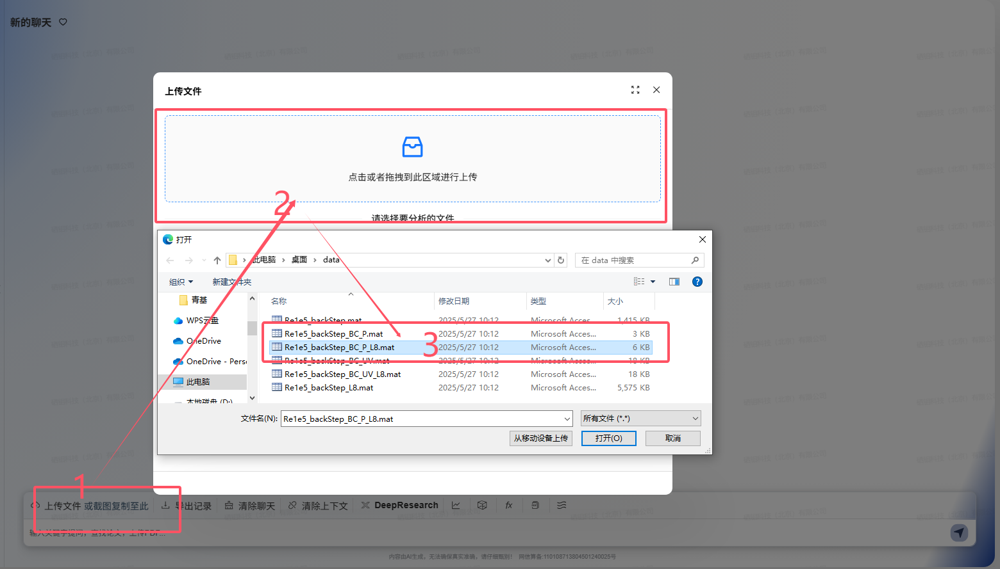
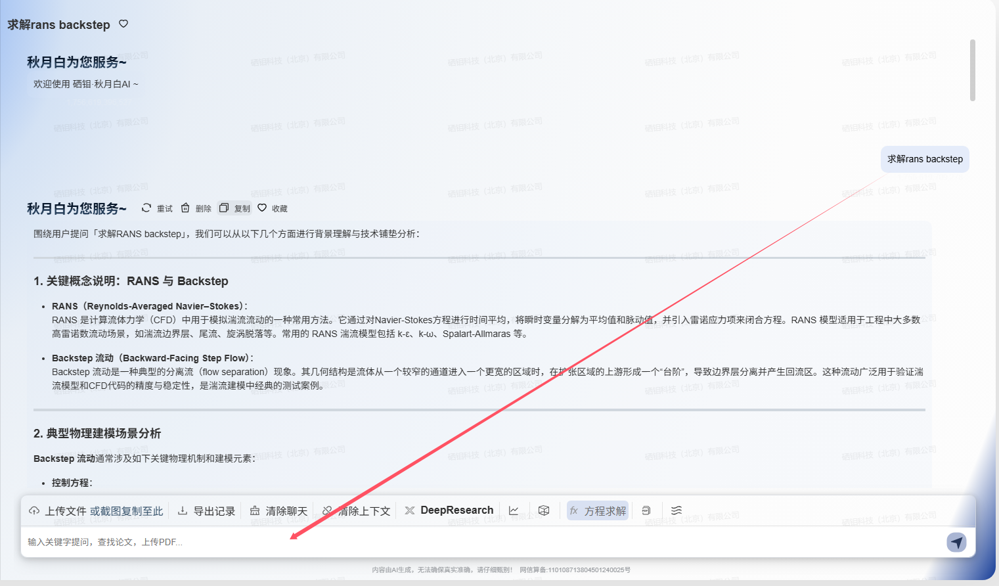
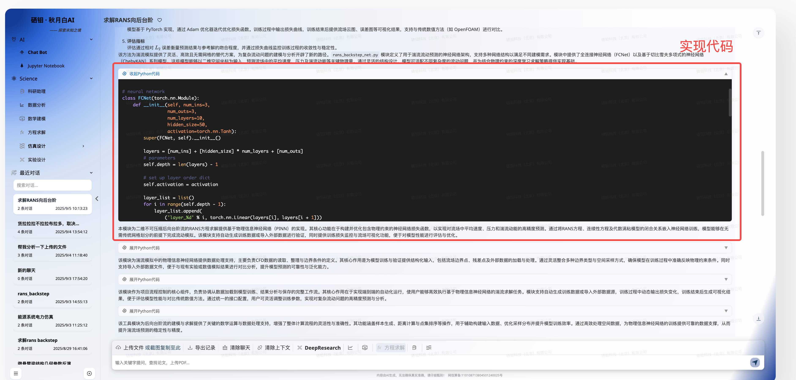
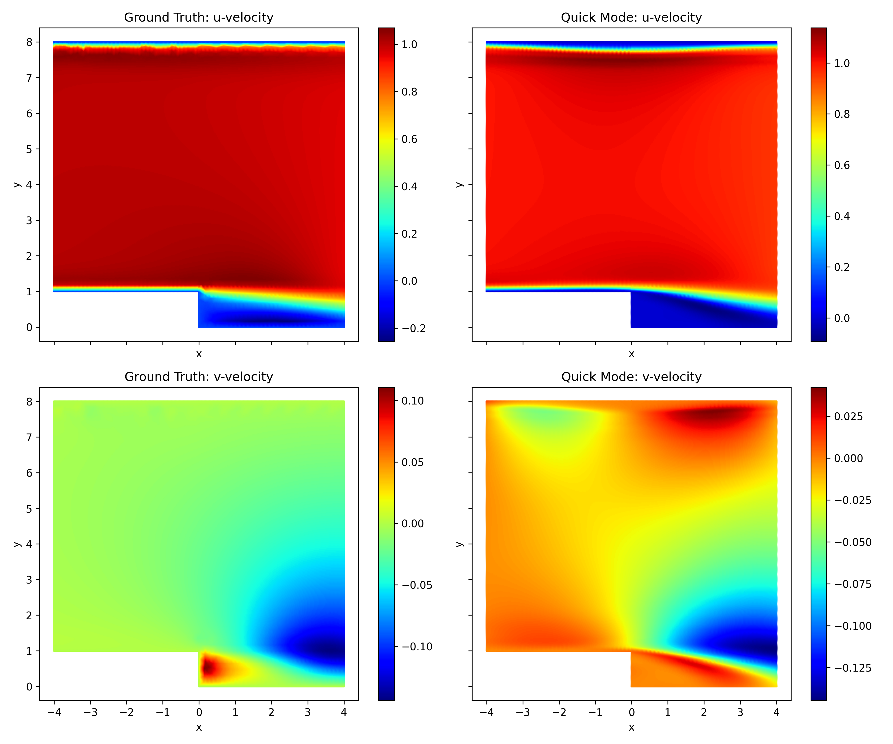
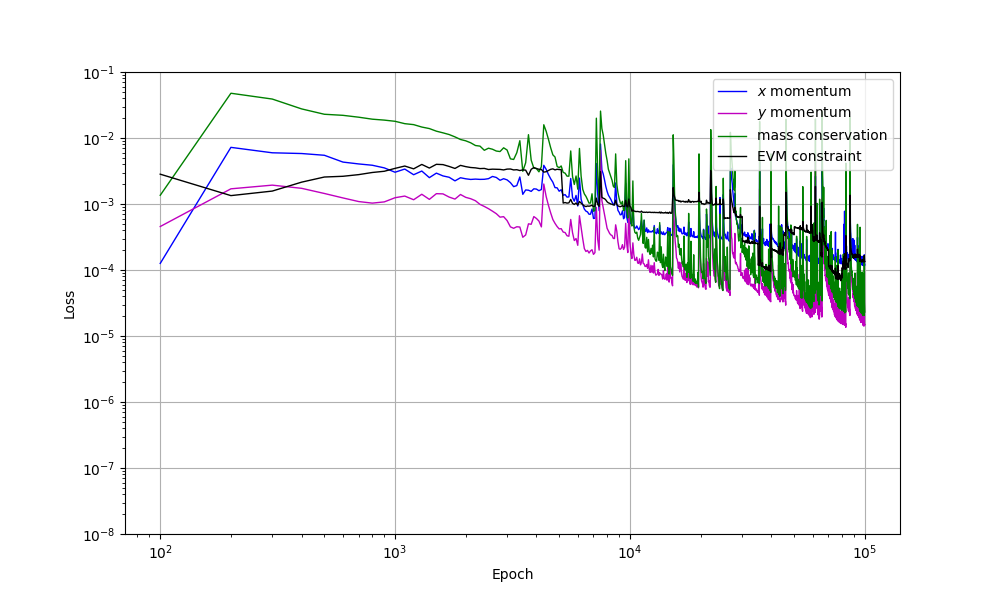
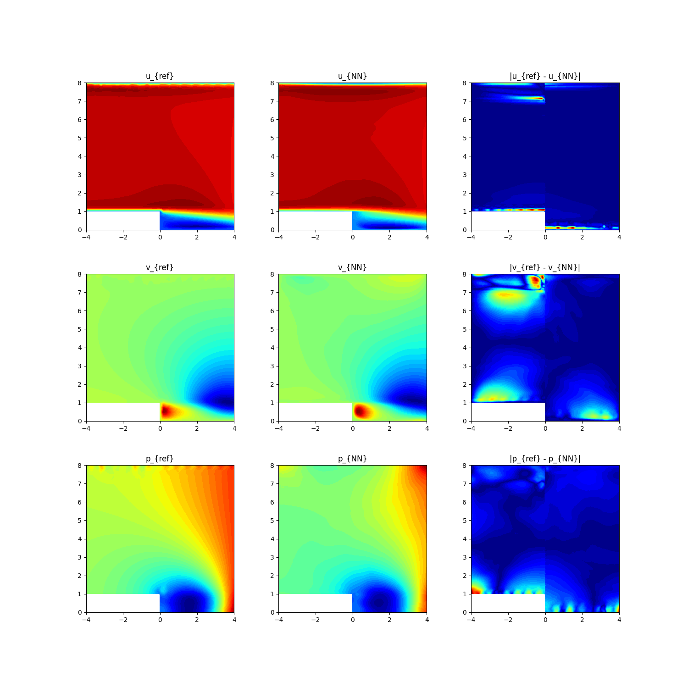
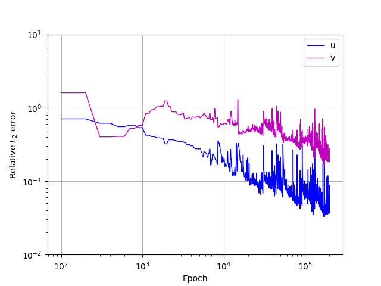

<!--
README.md文件名统一大写
 -->


<!--
text: "PINN-RANS-EVM：基于PINN与EVM的后向台阶流仿真",

area: "本项目旨在使用 **物理信息神经网络（PINN）** 结合 **代数涡粘模型（EVM）** 求解二维不可压缩流体后向台阶流的 **雷诺平均纳维–斯托克斯（RANS）方程**。通过在损失函数中施加控制方程残差（动量方程、连续性方程）和湍流模型约束，以及边界条件，实现对流场中的平均速度分量 $(\overline{u}, \overline{v})$、平均压力 $\overline{p}$ 以及湍流动能 $k$ 的联合预测。该方法为复杂湍流问题提供了一种无需网格、数据驱动与物理约束相结合的求解新范式。",

tags: ["航空航天", "飞行器气动设计", "流体力学", "物理信息神经网络(PINN)", "RANS", "代数涡粘模型(EVM)"],
-->

<!-- 项目名称为一级header ： # -->
# PINN-RANS-EVM：基于物理信息神经网络与涡粘模型的后向台阶流仿真

<!-- 项目概述：二级Header ：## -->
## 项目概述

准确模拟和预测复杂几何边界（如后向台阶）内的湍流流动特性，对于航空航天、水利工程、能量系统等领域的设计与优化至关重要。后向台阶流因其包含流动分离、剪切层发展、再附着和回流区等典型湍流现象，常被用作验证湍流模型和数值方法的标准算例。

本项目基于物理信息神经网络（PINN）与代数涡粘模型（EVM）相结合的框架，求解二维不可压缩流体的雷诺平均纳维–斯托克斯（RANS）方程，以模拟后向台阶流场。核心科学问题在于如何有效地将RANS方程的物理约束（包括动量守恒、质量守恒）以及湍流模型的闭合关系（EVM）融入深度神经网络的训练过程中，从而在稀疏数据或无数据情况下预测复杂流场。
## 使用示例

1. 进入秋月白页面，点击聊天框上方的 **方程求解** 图标
<!-- 添加图片方式：纯Markdown 格式 -->
|  | 
|:--:|
| **Fig.1 使用示例** |

2. 点击 **上传文件** 图标，上传数据文件（可选）

   支持格式：**mat**。  
   如果没有数据文件，模型会**自动生成仿真数据**用于训练和推理。

|  |
|:--:|
| **Fig.2 上传文件示例** |


3. 如果没有数据文件，模型会自动生成仿真数据用于训练和推理。

---

## 交互式示例流程（图示）

### A. **rans backstep**

1. 在对话框输入：**“求解rans backstep ”**

|        |
|:------------------------:|
| **Fig.3 在秋月白上的提问（rans backstep）** |  

2. 模型将先进行**分析与规划**，随后自动给出**完整的 rans backstep实现示例（Python 代码）**  

|                    |
|:------------------------------------:|
| **Fig.4 模型分析规划与完整代码（rans backstep）** |

3. 运行代码并训练，输出 **训练损失曲线**  得到流场对比图

|                |
|:--------------------------------:|
| **Fig.5 训练结果与Opem Foam计算速度流畅对比** |

---
预期输出结果包括：
-   二维平均速度场 $(\overline{u}(x,y), \overline{v}(x,y))$ 分布
-   平均压力场 $\overline{p}(x,y)$ 分布

技术路线采用PyTorch深度学习框架，构建PINN模型，其输入为空间坐标 $(x,y)$，输出为流场物理量 $(\overline{u}, \overline{v}, \overline{p})$。损失函数由PDE残差项（动量方程、连续性方程、EVM模型约束）和边界条件项构成。通过优化该损失函数，训练网络以逼近真实的物理场。


## 环境与依赖: 代码需要配置的环境

- Python ≥3.9
- PyTorch
- NumPy
- SciPy (可能用于数据处理或后处理)
- Matplotlib (用于可视化)

以上依赖可通过 `requirements.txt` 一键安装：

```bash
pip install -r requirements.txt
```

## 快速安装

```bash
# 建议使用虚拟环境
conda create -n pinn_evm python=3.9 -y
conda activate pinn_evm
pip install -r requirements.txt
```

下面是导入库部分的代码块，例如:

在本教程的 Notebook 中 (或 `train.py` 脚本中)，我们将逐步定义所需函数并构造基于纯物理约束的 PINNs 网络模型。请在 **Jupyter Notebook** (或Python脚本) 中依次运行以下代码块 (或确保已包含类似导入)：
#### 代码单元 1：导入必要库&设置设备

```python
import torch
import torch.nn as nn
import numpy as np
import scipy.io # If using .mat files for data
import matplotlib.pyplot as plt
import time

# 设置设备
device = torch.device("cuda" if torch.cuda.is_available() else "cpu")
print(f"使用设备: {device}")
```

## 数学背景
本项目基于不可压缩流体的纳维–斯托克斯方程，并通过雷诺平均和湍流模型（代数涡粘模型）进行简化，以适用于PINN框架。

### 物理约束

1.  **瞬时纳维–斯托克斯方程 (Navier–Stokes Equations)**  
    对于不可压牛顿流体，瞬时速度场 $u_i(x,t)$ 和压强场 $p(x,t)$ 满足：

动量方程：


$$
\rho\left(\frac{\partial u_i}{\partial t}+u_j\frac{\partial u_i}{\partial x_j}\right)= -\frac{\partial p}{\partial x_i}+ \mu\,\frac{\partial^2 u_i}{\partial x_j^2}
$$

连续性方程（质量守恒）：
$$
\frac{\partial u_i}{\partial x_i}=0
$$

其中，$\rho$ 为流体密度，$\mu$ 为动力粘度。文中采用爱因斯坦求和约定（重复指标求和）。

2.  **雷诺平均纳维–斯托克斯方程 (RANS Equations)**  
    将瞬时量分解为平均量 $\overline{(\cdot)}$ 和脉动量 $(\cdot)'$： $u_i = \overline{u}_i + u'_i$, $p = \overline{p} + p'$。代入NS方程并取时间平均（对于定常流动），得到定常RANS方程：
    动量方程：
    $$
    \rho \left(\overline{u}_j \frac{\partial \overline{u}_i}{\partial x_j}\right)
    = -\frac{\partial \overline{p}}{\partial x_i} + \mu \frac{\partial^2 \overline{u}_i}{\partial x_j^2} - \rho \frac{\partial \overline{u'_i u'_j}}{\partial x_j}
    $$
    
连续性方程：
$$
\frac{\partial \overline{u}_i}{\partial x_i} = 0
$$
最后一项 $-\rho \overline{u'_i u'_j}$ 是雷诺应力张量 $\tau_{ij}^{Reynolds} = -\rho \overline{u'_i u'_j}$，需要通过湍流模型进行封闭。

3.  **代数涡粘模型 (Algebraic Eddy Viscosity Model - EVM)**  
    本项目采用Boussinesq假设的代数涡粘模型对雷诺应力进行封闭：
    $$
    \tau_{ij}^{Reynolds} = -\rho \overline{u'_i u'_j}
    = 2 \mu_t S_{ij} - \frac{2}{3} \rho k \delta_{ij}
    $$
    其中 $S_{ij} = \frac{1}{2}\left(\frac{\partial \overline{u}_i}{\partial x_j} + \frac{\partial \overline{u}_j}{\partial x_i}\right)$ 是平均应变率张量， $k = \frac{1}{2}\overline{u'_m u'_m}$ 是湍流动能， $\delta_{ij}$ 是克罗内克符号。 $\mu_t$ 是湍流涡粘系数。
    对于不可压流，雷诺应力项在动量方程中常表示为 $\frac{\partial}{\partial x_j} (2 \mu_t S_{ij})$，因为 $\frac{2}{3}\rho k \delta_{ij}$ 项可以并入修正压力项。
    代数模型假设 $\mu_t$ 可以通过当地平均流场量代数地计算出来，例如：
    $$
    \mu_t = \alpha_{\rm evm} \rho \frac{k^2}{\epsilon^{\beta_{\rm evm}}}
    $$
    在简化的EVM中， $k$ 和耗散率 $\epsilon$ 可能通过更简单的代数关系或与平均流场梯度相关联。在本项目中， $\alpha_{\rm evm}$ 和 $\beta_{\rm evm}$ 似乎是作为调整参数通过损失权重间接影响模型或直接设定（如 $\alpha_{\rm evm}$ 在训练策略中被提及）。

#### 物理方程参数说明：

| 参数                      | 含义                                                              | 默认值 (或说明)          |
|:-------------------------:|:-----------------------------------------------------------------:|:------------------------:|
| $\overline{u}, \overline{v}$ | $x, y$ 方向的平均速度分量 (对于二维情况 $\overline{u}_1, \overline{u}_2$) | — (网络输出)             |
| $\overline{p}$            | 平均压力                                                          | — (网络输出)             |
| $x, y$                    | 空间坐标                                                          | — (网络输入)             |
| $\rho$                    | 流体密度                                                          | (通常为 `1.0` 无量纲化)    |
| $\mu$                     | 流体动力粘度                                                      | (例如 $1/Re$)             |
| $\mu_t$                   | 湍流涡粘系数                                                      | 通过EVM计算              |
| $k$                       | 湍流动能                                                          | 通过EVM模型关联           |
| $\epsilon$                | 湍流耗散率                                                        | 通过EVM模型关联           |
| $S_{ij}$                  | 平均应变率张量                                                    | 从 $\overline{u}, \overline{v}$ 计算 |
| $\tau_{ij}^{Reynolds}$    | 雷诺应力张量                                                      | 通过EVM模型计算           |
| $\alpha_{\rm evm}$        | EVM模型超参数                                                     | `0.05` (预热), `0.03` (主训练) |
| $\beta_{\rm evm}$         | EVM模型超参数 (若模型中显式使用)                                     | (未在Rans-README中明确给出) |

---

### PINN 损失函数
为了将上述物理约束嵌入神经网络训练，损失函数 $L_{total}$ 由以下几部分构成：
1.  **动量方程残差损失 ($L_{momentum}$)**:  
    对于 $x$ 方向动量 ($R_x$) 和 $y$ 方向动量 ($R_y$) (以二维为例)：
    $$
    R_x = \rho \left(\overline{u}\frac{\partial \overline{u}}{\partial x} + \overline{v}\frac{\partial \overline{u}}{\partial y}\right) + \frac{\partial \overline{p}}{\partial x} - \frac{\partial}{\partial x}\left( (\mu+\mu_t) \frac{\partial \overline{u}}{\partial x} \right) - \frac{\partial}{\partial y}\left( (\mu+\mu_t) \frac{\partial \overline{u}}{\partial y} \right) - \frac{\partial}{\partial x}\left( \mu_t \frac{\partial \overline{u}}{\partial x} \right) - \frac{\partial}{\partial y}\left( \mu_t \frac{\partial \overline{v}}{\partial x} \right) + \dots
    $$
    (注：实际的雷诺应力散度项 $\frac{\partial \tau_{ij}^{Reynolds}}{\partial x_j}$ 展开会更复杂，取决于 $\mu_t$ 的具体形式和 $S_{ij}$。这里简化表示为有效粘度 $(\mu+\mu_t)$ 作用于平均速度梯度，并可能包含额外的湍流项)。
    $L_{x\_momentum}, L_{y\_momentum}$，可表示为：

    $$
    L_{x\_momentum} = \frac{1}{N_{pde}} \sum |R_x|^2, \quad L_{y\_momentum} = \frac{1}{N_{pde}} \sum |R_y|^2
    $$

2.  **质量守恒 (连续性方程) 残差损失 ($L_{mass}$)**:
    $$
    R_{mass} = \frac{\partial \overline{u}}{\partial x} + \frac{\partial \overline{v}}{\partial y}
    $$
    
    $$
    L_{mass} = \frac{1}{N_{pde}} \sum |R_{mass}|^2
    $$

3.  **EVM 模型约束损失 ($L_{EVM}$)**:  
    此损失项确保涡粘系数 $\mu_t$ 的计算符合所选的EVM代数关系。如果 $\mu_t$ 是网络的另一个输出或通过 $k, \epsilon$ (也是网络输出) 计算得到，则 $L_{EVM}$ 将强制执行 $k, \epsilon$ 的输运方程或 $\mu_t$ 的代数表达式。  
    (具体形式依赖于 `scripts/pinn_solver_2D.py` 中EVM的实现)

4.  **边界条件损失 ($L_{BC}$)**:  
    在计算域的边界上，对速度 $(\overline{u}, \overline{v})$ 和压力 $\overline{p}$ (或其梯度) 施加Dirichlet或Neumann条件。
    $$
    L_{BC} = \frac{1}{N_{bc}} \sum ( \text{NetOutput}_{BC} - \text{TargetValue}_{BC} )^2
    $$

总损失函数是这些分量的加权和：

$$
L_{total} = w_{x\_mom} L_{x\_momentum} + w_{y\_mom} L_{y\_momentum} + w_{mass} L_{mass} + w_{EVM} L_{EVM} + w_{BC} L_{BC}
$$

权重 $w_{x\_mom}, w_{y\_mom}, w_{mass}, w_{EVM}$ 均为 $1$。$w_{BC}$ 未明确给出，但通常也是重要的。

#### 符号说明：

| 符号                          | 含义                                                                 |
|:-----------------------------:|:--------------------------------------------------------------------:|
| $(\overline{u}, \overline{v}, \overline{p})$ | 网络预测的平均速度分量和平均压力                                           |
| $R_x, R_y, R_{mass}$          | $x$-动量、$y$-动量、质量守恒方程的残差                                    |
| $L_{x_{momentum}}, \dots, L_{BC}$ | 对应物理约束或边界条件的损失项                                           |
| $N_{pde}, N_{bc}$               | PDE配置点数量、边界点数量                                                |
| $w_{x_{mom}}, \dots, w_{BC}$       | 各损失项的权重                                                         |

> 💡 **说明：**  
> - 所有导数均通过PyTorch的自动微分功能计算。
> - 具体的EVM实现细节（例如 $\mu_t$ 如何从网络输出或基本物理量计算得到）会影响 $L_{EVM}$ 和动量方程中 $\mu_t$ 相关项的具体形式。

---
## 网络模型章节：PINN求解RANS方程
本项目使用一个全连接神经网络 (FCNN / MLP) 作为PINN的核心，用于逼近二维后向台阶流的RANS解。

`PINN_Solver_2D` 的核心功能包括：
1.  **流场量预测**: 输入空间坐标 $(x,y)$，输出平均速度 $(\overline{u}, \overline{v})$ 和平均压力 $\overline{p}$。
2.  **自动微分**: 计算网络输出相对于输入的导数，以构造RANS方程和EVM模型的残差。
3.  **损失函数计算**: 综合PDE残差损失、EVM约束损失和边界条件损失。

### 构造基本的 MLP 子网络
-   输入层：2个神经元 (对应 $x, y$ 坐标)
-   隐藏层：2层，第一层120个神经元，第二层40个神经元。激活函数均为 Tanh。
-   输出层：3个神经元 (对应 $\overline{u}, \overline{v}, \overline{p}$)


---
### 构造 `PINN_Solver_2D` 模型 (概念)


#### 1. `__init__`: 构造函数
初始化MLP网络、物理参数（如 $\rho, \mu, \alpha_{\rm evm}$）以及可能的边界条件数据。

请在 `scripts/pinn_solver_2D.py` 中查找或构建类似如下结构的类：
#### 代码单元 2：`PINN_Solver_2D` 类 (概念框架)

```python

class PINNSolver2D(nn.Module):
    def __init__(self, mlp_input_dim, mlp_output_dim, mlp_hidden_neurons, rho, mu, alpha_evm_initial):
        super(PINNSolver2D, self).__init__()
        self.net_uvp = MLP(mlp_input_dim, mlp_output_dim, mlp_hidden_neurons, activation=torch.tanh)
        
        self.rho = rho
        self.mu = mu
        self.alpha_evm = torch.tensor([alpha_evm_initial], device=device, dtype=torch.float32) # May be updated during training

       
    def forward(self, x_y_coords):
       
        uvp = self.net_uvp(x_y_coords)
        u = uvp[:, 0:1]
        v = uvp[:, 1:2]
        p = uvp[:, 2:3]
        return u, v, p

    def compute_rans_residuals(self, x_y_coords):
        x = x_y_coords[:, 0:1].requires_grad_(True)
        y = x_y_coords[:, 1:2].requires_grad_(True)
        
        u, v, p = self.forward(torch.cat((x, y), dim=1))

        u_x = torch.autograd.grad(u, x, grad_outputs=torch.ones_like(u), create_graph=True)[0]
        u_y = torch.autograd.grad(u, y, grad_outputs=torch.ones_like(u), create_graph=True)[0]
        strain_rate_mag_sq = u_x**2 + v_y**2 + 0.5*(u_y + v_x)**2
        mu_t_example = self.alpha_evm * self.rho * strain_rate_mag_sq 
        
        effective_mu = self.mu + mu_t_example
        R_x = torch.zeros_like(u) 
        R_y = torch.zeros_like(v) 
        R_mass = torch.zeros_like(p) 
        R_evm = torch.zeros_like(p) 

        return R_x, R_y, R_mass, R_evm

    def loss(self, pde_coords, bc_coords_values, weights):
        
        R_x, R_y, R_mass, R_evm = self.compute_rans_residuals(pde_coords)
        loss_x_momentum = torch.mean(R_x**2)
        loss_y_momentum = torch.mean(R_y**2)
        loss_mass = torch.mean(R_mass**2)
        loss_evm = torch.mean(R_evm**2) 

       
        loss_bc_total = torch.tensor(0.0, device=device)
        total_loss = weights['x_mom'] * loss_x_momentum + \
                     weights['y_mom'] * loss_y_momentum + \
                     weights['mass'] * loss_mass + \
                     weights['evm'] * loss_evm + \
                     weights.get('bc', 1.0) * loss_bc_total # Use .get for bc weight
        
        losses_dict = {
            'total': total_loss, 'x_mom': loss_x_momentum, 'y_mom': loss_y_momentum,
            'mass': loss_mass, 'evm': loss_evm, 'bc': loss_bc_total
        }
        return losses_dict

```

> 💡 **解读：**
> - `PINNSolver2D` 包含一个MLP (`self.net_uvp`) 来预测 $(\overline{u}, \overline{v}, \overline{p})$。
> - `compute_rans_residuals` 方法是核心，它利用自动微分计算所有必要的偏导数，然后代入RANS方程和EVM表达式中得到各项残差。EVM的具体实现（如何计算 $\mu_t$ 和相关量 $k, \epsilon$）对该方法至关重要。
> - `loss` 方法汇总来自PDE（动量、质量、EVM）和边界条件的损失。

> 🔍 **提示：**
> - 代数涡粘模型 (EVM) 的实现细节在 `scripts/pinn_solver_2D.py` 中。这可能包括 $\mu_t$ 如何通过 $k$ 和 $\epsilon$ (湍流动能及其耗散率) 计算，或者 $k$ 和 $\epsilon$ 本身也是网络输出或通过其他代数关系得到。
> - $\alpha_{\rm evm}$ 是一个关键的超参数，在训练过程中可能会调整。

---
## 数据处理
`scripts/rans_data.py` 负责训练和测试数据的读取与重构。这可能包括：
- 从文件（如 `.mat` 或 `.csv`）加载几何信息、边界条件采样点、内部PDE配置点。
- 如果有参考解（来自CFD或实验），加载这些数据用于验证或作为 $L_{data}$ 的一部分。
- 对数据进行归一化或必要的预处理。


## 模型训练与评估
训练过程旨在最小化总损失函数，涉及迭代更新网络权重。评估则关注预测精度和物理约束的满足程度。

### 训练策略
- **优化器**: Adam
- **学习率**: 初始 $3 \times 10^{-4}$，指数衰减
- **损失项权重**: $L_{x\_momentum}=1, L_{y\_momentum}=1, L_{mass}=1, L_{EVM}=1$
- **训练阶段**:
    1.  预热阶段：10,000 epochs，$\alpha_{\rm evm}=0.05$
    2.  主训练阶段：100,000 epochs，$\alpha_{\rm evm}=0.03$ (在 `pinn_solver_2D.py` 中更新模型的 `alpha_evm` 参数)


### 模型评估
- **相对 $L_2$ 误差**: 比较预测场 $(\overline{u}, \overline{v}, \overline{p})$ 与参考解（CFD/实验数据），计算公式为 $E = \frac{\| \Psi_{pred} - \Psi_{ref} \|_2}{\| \Psi_{ref} \|_2}$。
- **损失曲线**: 监控各物理约束损失和总损失随训练迭代的变化。

#### 损失曲线
|  |
|:-----------------------:|
|     **Fig.6** 损失曲线      |

#### 代码单元 3： 绘制损失曲线

```python
def plot_loss_history_rans(loss_history, title="RANS PINN Loss History"):
    plt.figure(figsize=(12, 7))
    epochs_total = len(loss_history['total'])
    for key, values in loss_history.items():
        if key != 'total' and len(values) == epochs_total and values[0] is not None:
             # Plot only if there are significant values to show
            if np.any(np.array(values) > 1e-9) or key in ['x_mom', 'y_mom', 'mass']: # Always plot main PDE terms
                plt.plot(values, label=key.replace('_', ' ').capitalize() + ' Loss', alpha=0.7)
    plt.plot(loss_history['total'], label='Total Loss', linewidth=2, color='black')
    
    plt.xlabel('Epoch')
    plt.ylabel('Loss Value (log scale)')
    plt.yscale('log')
    plt.title(title)
    plt.legend(loc='upper right')
    plt.grid(True, which="both", ls="--")
    plt.tight_layout()
    # plt.savefig("./viz/training_loss_curve.png") # Example save
    plt.show()

```

|  |
|:-----------------------:|
|   **Fig.7** 各物理约束损失曲线   |

---
## 结果可视化


### 流场云图与误差
本案例提供了 `uv_contour.png` 和 `UV_error2.png`。

#### 代码单元 4： 可视化函数 (概念，实际在 `visualize_results.py`)

```python
# Conceptual visualization structure, actual implementation in scripts/visualize_results.py
def visualize_flow_fields(model, visualization_coords, ref_data_vis=None, save_path_prefix="./viz/"):
    model.eval()
    with torch.no_grad():
        u_pred, v_pred, p_pred = model(visualization_coords)
    
    u_pred_np = u_pred.cpu().numpy()
    v_pred_np = v_pred.cpu().numpy()
    p_pred_np = p_pred.cpu().numpy()
    x_coords_np = visualization_coords[:, 0].cpu().numpy()
    y_coords_np = visualization_coords[:, 1].cpu().numpy()

    print("Visualization logic from scripts/visualize_results.py would run here.")
    print("This would generate plots like velocity contours, pressure contours, error plots.")

# python ./scripts/visualize_results.py (after training is complete and model saved)
```

|  |
|:-------------------------:|
| **Fig.8** 速度、压力场预测与参考解对比  |

|       |
|:-----------------------------:|
| **Fig.9** 相对 $L_2$ 误差随训练迭代的变化 |


---
## 主函数与数据加载
`train.py` 脚本负责整合模型的定义、数据加载、训练过程和调用可视化。

运行命令：
```bash
# 在项目根目录下执行训练
python train.py
# 训练完成后，执行可视化脚本
python ./scripts/visualize_results.py
```


## 贡献与许可证

恭喜您完成本项目的全部 Tutorial 学习！您可以使用本文提供的模块化代码概念和文中提及的脚本 (`scripts/pinn_solver_2D.py`, `scripts/rans_data.py`, `train.py`, `scripts/visualize_results.py`) 来复现或扩展后向台阶流的PINN仿真。

**贡献者：**  
- Ming Kang
- Yuhao Ma

**许可证：**  
本项目代码遵循 [GNU 通用公共许可证 第三版（GPLv3）](https://www.gnu.org/licenses/gpl-3.0.html)。您可以自由使用、修改和分发该代码，但需保留原始版权声明，并在分发时提供相同的许可证。

版权 © 硒钼科技（北京）。更多信息请访问 [Science42](https://www.science42.tech/#/index)。