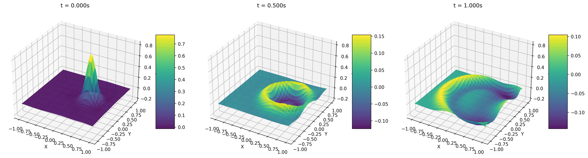
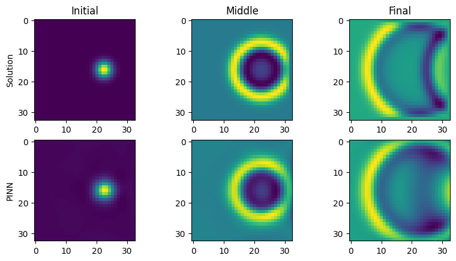

<!-- text: "2D 波动方程：初始与边界约束的物理信息神经网络（PINN）求解", area: "本项目旨在利用**物理信息神经网络（PINN）**高效求解经典的**二维波动方程**，以模拟波在时空域中的传播与演化。通过将波动方程、**初始条件**（包括初始位移和初始速度）和**边界条件**（Dirichlet 约束）直接编码到神经网络的**复合损失函数**中，PINN 提供了一种无需网格离散的解决方案。该方法利用自动微分精确计算所需的高阶时空导数。项目目标是精确预测在给定初始高斯波包和固定边界下，波场 `u(x, y, t)` 的动态演化过程。", tags: [ "基础求解算法", "基础方程", "时空建模", "声学工程", "数据可视化" ] -->

---

# 2D 波动方程：物理信息神经网络（PINN）求解

## 项目概述

本项目专注于利用**物理信息神经网络（Physics-Informed Neural Network, PINN）** 求解经典的**二维 (2D) 波动方程**。波动方程是描述声波、光波、水波等多种物理现象传播过程的基础偏微分方程（PDE）。通过在神经网络的训练过程中引入物理约束，PINN 能够有效预测波在时空域 `(x, y, t)` 内的演化行为 `u(x,y,t)`。

传统的数值方法（如有限差分法、有限元法或谱方法）需要对时空域进行精细的网格离散。而 PINN 提供了一种无网格的替代方案，它将波动方程本身、**边界条件（Boundary Conditions, BCs）**和**初始条件（Initial Conditions, ICs）**直接编码到神经网络的损失函数中。这种方法不依赖于大量的标注数据，而是通过最小化物理残差来驱动网络学习 PDE 的解。

本项目的目标是训练一个深度神经网络，使其能够精确预测在给定的初始波形和边界约束下，波场 `u` 随时间 `t` 在二维空间 `(x, y)` 中的传播情况。

*   **问题核心**: 求解二阶双曲型偏微分方程 `u_tt = u_xx + u_yy`。
*   **方法**: 将 PDE、初始条件 (初始位移和初始速度) 和边界条件共同作为损失项，训练一个全连接神经网络。
*   **优势**: 无需显式网格，直接在连续的时空域上求解，并通过自动微分精确计算所需的高阶导数 (`u_tt`, `u_xx`, `u_yy`)。

|                             |
| :--------------------------------------------: |
| **Fig. 1** 2D 波动方程 PINN 预测在不同时刻的解 |

## 核心功能与方法

*   **二维波动方程求解**: 解决在给定初始分布、初始速度和 Dirichlet 边界条件下的波动问题。
*   **物理信息神经网络 (PINN)**: 将 2D 波动方程、初始条件和边界条件直接嵌入到神经网络的复合损失函数中。
*   **全连接神经网络 (FCN / MLP)**: 采用多层感知机作为函数逼近器，从时空坐标 `(x, y, t)` 预测波的振幅 `u`。
*   **自动微分 (Automatic Differentiation)**: 利用 PyTorch 的自动微分功能，精确计算解 `u` 对时间 `t` 和空间 `x, y` 的二阶偏导数。
*   **复合损失函数**: 包含 PDE 残差损失、初始条件损失（位移和速度）和边界条件损失，共同指导模型训练。
*   **拉丁超立方采样 (LHS)**: 使用 `pyDOE` 库的 LHS 方法在时空域内高效生成搭配点 (collocation points)、初始点和边界点。
*   **时空可视化**: 提供直观的二维图像，展示数值参考解和 PINN 预测解在初始、中间和最终时刻的波场分布，便于对比分析。

## 数学背景

本项目旨在求解定义在时空域 $\Omega \times [0, T]$ 上的二维波动方程，其中空间域 $\Omega = [-1, 1] \times [-1, 1]$。

### 物理约束

1.  **波动方程 (Wave Equation)**
    控制波场 `u(x, y, t)` 演化的偏微分方程如下（设波速 c=1）:

    $$
    \frac{\partial^2 u}{\partial t^2} = \frac{\partial^2 u}{\partial x^2} + \frac{\partial^2 u}{\partial y^2} \quad \text{for} \quad (x,y,t) \in \Omega \times (0, T]
    $$

    该方程是 PINN 损失函数中的核心物理约束。

2.  **边界条件 (Boundary Conditions)**
    在空间域 $\Omega$ 的边界 $\partial\Omega$ 上，施加固定的 Dirichlet 边界条件，即波在边界处的振幅始终为零：

    $$
    u(x, y, t) = 0 \quad \text{for} \quad (x,y) \in \partial\Omega, \ t \in [0, T]
    $$

3.  **初始条件 (Initial Conditions)**
    为了确定一个唯一的解，需要指定 `t=0` 时刻的初始状态，包括初始位移和初始速度。
    *   **初始位移 (Initial Displacement)**:

        $$
        u(x, y, 0) = \exp(-40((x-0.4)^2 + y^2))
        $$

        这表示一个初始的高斯波包，其中心位于 `(0.4, 0)`。
    *   **初始速度 (Initial Velocity)**:

        $$
        \frac{\partial u}{\partial t}(x, y, 0) = 0
        $$

        这表示波在初始时刻是静止的。

#### 物理方程参数说明

| 参数             | 含义                               | 本项目设定值                 |
| :--------------- | :--------------------------------- | :--------------------------- |
| $u(x,y,t)$       | 在时空点 `(x,y,t)` 的波振幅        | —                            |
| $c$              | 波速 (Wave speed)                  | `1`                          |
| $\Omega$         | 二维空间域 (Spatial domain)        | `[-1, 1] x [-1, 1]`          |
| $T$              | 总模拟时间 (Total simulation time) | `1.0` s                      |
| $\partial\Omega$ | 空间域的边界                       | `x=±1` 或 `y=±1`             |
| $u(x,y,0)$       | 初始位移分布                       | $\exp(-40((x-0.4)^2 + y^2))$ |
| $u_t(x,y,0)$     | 初始速度分布                       | `0`                          |

### PINN 损失函数

PINN 的总损失函数 $\mathcal{L}$ 是多个物理约束损失项的线性组合，驱动神经网络学习满足所有条件的解。

#### PDE 残差损失 ($L_{PDE}$)

该损失衡量网络预测解对波动方程的满足程度，在从域内采样的搭配点上计算。

$$
L_{PDE} = \frac{1}{N_f} \sum_{i=1}^{N_f} \left| \frac{\partial^2 u}{\partial t^2}(x_i, y_i, t_i) - \left( \frac{\partial^2 u}{\partial x^2}(x_i, y_i, t_i) + \frac{\partial^2 u}{\partial y^2}(x_i, y_i, t_i) \right) \right|^2
$$

#### 边界条件损失 ($L_{BC}$)

该损失惩罚网络预测解在边界上的偏差。

$$
L_{BC} = \frac{1}{N_b} \sum_{i=1}^{N_b} \left| u(x_i, y_i, t_i) \right|^2 \quad \text{where} \quad (x_i, y_i) \in \partial\Omega
$$

#### 初始条件损失 ($L_{IC}$)

该损失包含两个部分：初始位移损失和初始速度损失。

*   **初始位移损失 ($L_{IC,u}$):**

    $$
    L_{IC,u} = \frac{1}{N_i} \sum_{i=1}^{N_i} \left| u(x_i, y_i, 0) - \exp(-40((x_i-0.4)^2 + y_i^2)) \right|^2
    $$

*   **初始速度损失 ($L_{IC,u_t}$):**

    $$
    L_{IC,u_t} = \frac{1}{N_i} \sum_{i=1}^{N_i} \left| \frac{\partial u}{\partial t}(x_i, y_i, 0) - 0 \right|^2
    $$

#### 总损失函数 ($\mathcal{L}$)

总损失函数是以上所有损失项的和（本项目中权重均为 1）。

$$
\mathcal{L} = L_{PDE} + L_{BC} + L_{IC,u} + L_{IC,u_t}
$$

通过最小化 $\mathcal{L}$，神经网络被训练以同时满足物理定律和所有给定的初始/边界条件。

## 环境与依赖

*   Python ≥ 3.8
*   PyTorch ≥ 1.10
*   NumPy
*   Matplotlib
*   pyDOE (用于拉丁超立方采样)
*   SciPy (仅用于生成数值参考解)
*   tqdm (用于显示训练进度条)

## 快速开始

### 数据文件

本项目**无需外部数据文件**。用于对比的数值参考解由代码中的 `WaveEquation` 类通过谱方法（Spectral Solver）动态生成。PINN 的训练完全依赖于从物理约束（PDE、IC、BC）中构建的损失函数。

### 安装依赖

建议使用虚拟环境进行安装：

```bash
conda create -n pinn_wave_2d python=3.9
conda activate pinn_wave_2d
pip install torch torchvision torchaudio --extra-index-url https://download.pytorch.org/whl/cu118 # 根据你的CUDA版本选择
pip install numpy matplotlib scipy pyDOE tqdm
```

### 运行脚本

将提供的 Jupyter Notebook 代码整合为一个 Python 脚本（例如 `main.py`），或在 Jupyter 环境中按顺序执行代码单元。

**运行完整流程**

```bash
python main.py
```

脚本将执行以下步骤：
1.  **生成参考解**: 运行 `WaveEquation` 类来计算数值解（用于最终对比）。
2.  **设置 PINN**: 初始化 `MLP` 网络。
3.  **数据采样**: 使用 LHS 生成初始、边界和域内搭配点。
4.  **训练**: 执行主训练循环，最小化复合损失函数。
5.  **评估与可视化**:
    *   打印训练时间和最终的 L2 误差。
    *   生成对比图，展示数值解和 PINN 预测解在 `t=0`、`t=T/2` 和 `t=T` 时刻的波场。

**关键默认参数 (可在代码中修改):**

*   `time_end = 1.0` (模拟总时长)
*   `num_layers = 5` (神经网络隐藏层数量)
*   `num_neurons = 100` (每层神经元数量)
*   `N_i = 1000` (初始条件采样点数)
*   `N_b = 1000` (边界条件采样点数)
*   `N_f = 20000` (PDE 搭配点数)
*   `epochs = 20000` (训练轮次)
*   `lr = 1e-3` (初始学习率)

## 模型构建

#### 代码单元 1：全连接神经网络模型 (MLP)

这个代码块定义了 `MLP` 类，它是一个**全连接神经网络 (Multi-Layer Perceptron)**，作为 PINN 的核心函数逼近器。它接收时空坐标 `(x, y, t)` 作为输入，并预测该点的波振幅 `u`。

```python
class MLP(nn.Module):
    def __init__(self, in_features, out_features, num_layers, num_neurons, activation=torch.tanh):
        super(MLP, self).__init__()

        self.in_features = in_features
        self.out_features = out_features
        self.num_layers = num_layers
        self.num_neurons = num_neurons

        self.act_func = activation # 激活函数，默认为 tanh

        self.layers = nn.ModuleList()

        # 输入层
        self.layer_input = nn.Linear(self.in_features, self.num_neurons)

        # 隐藏层
        for ii in range(self.num_layers - 1):
            self.layers.append(nn.Linear(self.num_neurons, self.num_neurons))
        
        # 输出层
        self.layer_output = nn.Linear(self.num_neurons, self.out_features)

    def forward(self, x):
        # 前向传播
        x_temp = self.act_func(self.layer_input(x))
        for dense in self.layers:
            x_temp = self.act_func(dense(x_temp))
        x_temp = self.layer_output(x_temp)
        return x_temp
```

> 💡 **解读：**
>
> -   **功能**：构建一个可定制层数和神经元数量的全连接网络。
> -   **核心**：使用 `torch.nn.Linear` 定义线性层和 `torch.nn.ModuleList` 管理隐藏层。`torch.tanh` 因其平滑性和良好的导数特性，是 PINN 中的常用激活函数。
> -   **用途**：作为 PINN 的函数近似器 $\mathcal{N}(x, y, t; \theta) \approx u(x, y, t)$，其参数 $\theta$ 将通过最小化物理损失进行优化。

#### 代码单元 2：自动微分工具

PINN 的关键在于能够计算网络输出对输入的导数。PyTorch 的自动微分功能使得这一过程非常便捷。代码中使用一个 lambda 函数 `deriv` 来封装此操作。

```python
#Setting up a derivative function that goes through the graph and calculates via chain rule the derivative of u wrt x 
deriv = lambda u, x: torch.autograd.grad(u, x, grad_outputs=torch.ones_like(u), create_graph=True, allow_unused=True)[0]
```

> 💡 **解读：**
>
> -   **功能**：计算张量 `u` 相对于张量 `x` 的一阶偏导数。
> -   **核心**：`torch.autograd.grad` 是 PyTorch 自动微分引擎的核心接口。
> -   `grad_outputs=torch.ones_like(u)`: 对于标量输出的函数，这是标准用法。
> -   `create_graph=True`: 这一步至关重要，因为它创建了一个用于计算高阶导数的计算图。例如，要计算 `u_xx`，需要先计算 `u_x = deriv(u, x)`，然后再次调用 `deriv(u_x, x)`。
> -   **用途**：在损失函数中计算 `u_t`, `u_tt`, `u_x`, `u_xx`, `u_y`, `u_yy`，以构建 PDE 残差。

## 模型训练

#### 代码单元 3：数据采样

PINN 是在无监督模式下训练的（即不使用 `(输入, 输出)` 对形式的标注数据），但它仍需要在时空域中采样点来评估物理损失。代码使用**拉丁超立方采样 (LHS)** 在初始时刻、边界和整个域内生成这些点。

```python
from pyDOE import lhs

# Specifying the Domain of Interest. 
x_range = [-1.0, 1.0]
y_range = [-1.0, 1.0]
t_range = [0.0, time_end]

lb = np.asarray([x_range[0], y_range[0], t_range[0]])
ub = np.asarray([x_range[1], y_range[1], t_range[1]])

# Fucnction to sample collocation points across the spatio-temporal domain using a Latin Hypercube
def LHS_Sampling(N):
    return lb + (ub-lb)*lhs(3, N)

# Samples taken from each region for optimisation purposes. 
N_i = 1000 # Initial
N_b = 1000 # Boundary
N_f = 20000 # Domain

# Data for Initial Input (t=0)
# ... (Code generates X_i and u_i)

# Data for Boundary Input
# ... (Code generates X_b on x=±1 and y=±1)

# Data for Domain Input (Collocation points)
X_f = LHS_Sampling(N_f)
```

> 💡 **解读：**
>
> -   **功能**：为训练准备三类数据点：初始点 (`X_i`)、边界点 (`X_b`) 和 PDE 搭配点 (`X_f`)。
> -   **核心**：`pyDOE.lhs` 生成在多维空间中均匀分布的样本点，比纯随机采样具有更好的空间填充性。
> -   **用途**：
>     -   `X_i` 用于计算初始条件损失。
>     -   `X_b` 用于计算边界条件损失。
>     -   `X_f` 用于计算 PDE 残差损失。

#### 代码单元 4：损失函数实现

这部分代码将数学背景中定义的损失函数转化为可执行的 PyTorch 代码。

```python
# Domain Loss Function - measuring the deviation from the PDE functional. 
def pde(X):
    x, y, t = X[:, 0:1], X[:, 1:2], X[:, 2:3]
    u = npde_net(torch.cat([x,y,t],1))

    u_x = deriv(u, x); u_xx = deriv(u_x, x)
    u_y = deriv(u, y); u_yy = deriv(u_y, y)
    u_t = deriv(u, t); u_tt = deriv(u_t, t)
    
    pde_loss = u_tt - (u_xx + u_yy)
    return pde_loss.pow(2).mean()

# Boundary Loss Function
def boundary(X):
    u = npde_net(X)
    bc_loss = u - 0 
    return bc_loss.pow(2).mean()

# Initial Velocity Condition
def initial_velocity(X):
    x, y, t = X[:, 0:1], X[:, 1:2], X[:, 2:3]
    u = npde_net(torch.cat([x,y,t],1))
    u_t = deriv(u, t)
    initial_cond_loss = u_t - 0
    return initial_cond_loss.pow(2).mean()

# Reconstruction Loss Function (Initial Displacement)
def reconstruction(X, Y):
    u = npde_net(X)
    recon_loss = u-Y
    return recon_loss.pow(2).mean()
```

> 💡 **解读：**
>
> -   **功能**：实现 `L_PDE`, `L_BC`, `L_IC,u_t` 和 `L_IC,u` 的计算。
> -   **核心**：
>     -   `pde` 函数通过多次调用 `deriv` 来计算二阶导数，并构建波动方程的残差。
>     -   `boundary`, `initial_velocity`, `reconstruction` 函数直接计算网络输出与目标值（0 或初始位移）之间的均方误差。
> -   **用途**：这些函数在训练循环中被调用，以计算总损失，从而指导模型优化。

#### 代码单元 5：训练循环

这是模型优化的核心部分，通过 Adam 优化器迭代更新网络权重，以最小化总损失。

```python
optimizer = torch.optim.Adam(npde_net.parameters(), lr=1e-3)
scheduler = torch.optim.lr_scheduler.StepLR(optimizer, step_size=5000, gamma=0.9)

it=0
epochs = 20000 #Number of Epochs for the training loop. 
loss_list = []

start_time = time.time()
while it < epochs :
    optimizer.zero_grad()

    # Calculate individual loss components
    initial_loss = reconstruction(X_i, Y_i) + initial_velocity(X_i)
    boundary_loss = boundary(X_b)
    domain_loss = pde(X_f)

    # Sum up to get the total loss
    loss = initial_loss + boundary_loss + domain_loss   
    loss_list.append(loss.item())
    
    # Backpropagation and optimization step
    loss.backward()
    optimizer.step()
    scheduler.step()

    it += 1

    print('It: %d, Init: %.3e, Bound: %.3e, Domain: %.3e' % (it, initial_loss.item(), boundary_loss.item(), domain_loss.item()))
```

> 💡 **解读：**
>
> -   **功能**：执行完整的训练流程。
> -   **核心**：标准的 PyTorch 训练循环：
>     1.  `optimizer.zero_grad()`: 清除上一轮的梯度。
>     2.  `loss.backward()`: 计算损失相对于所有可训练参数的梯度。
>     3.  `optimizer.step()`: 根据梯度更新网络参数。
> -   **用途**：通过数万次迭代，驱动 `npde_net` 的参数收敛，使其输出的 `u(x,y,t)` 能够满足所有物理约束。

## 可视化

#### 代码单元 6：结果评估与可视化

训练完成后，此代码块将 PINN 的预测结果与通过数值方法（谱方法）得到的参考解进行比较，并绘制对比图。

```python
# Getting the trained output. 
# ... (Code to get u_pred from the trained network)
        
l2_error = np.mean((u_actual - u_pred)**2)
print('Training Time: %d seconds, L2 Error: %.3e' % (train_time, l2_error))

# Reshape prediction for plotting
u_pred = u_pred.reshape(len(u), grid_length, grid_length)

# Plotting the PINN solution against the Numerical solution. 
u_field_sol = u_sol # Numerical solution
u_field_pinn = u_pred # PINN prediction

fig = plt.figure(figsize=plt.figaspect(0.5))

# Plot initial state (t=0)
ax = fig.add_subplot(2,3,1); ax.imshow(u_field_sol[0]); ax.title.set_text('Initial'); ax.set_ylabel('Solution')
ax = fig.add_subplot(2,3,4); ax.imshow(u_field_pinn[0]); ax.set_ylabel('PINN')

# Plot middle state (t=T/2)
ax = fig.add_subplot(2,3,2); ax.imshow(u_field_sol[int(len(t)/2)]); ax.title.set_text('Middle')
ax = fig.add_subplot(2,3,5); ax.imshow(u_field_pinn[int(len(t)/2)])

# Plot final state (t=T)
ax = fig.add_subplot(2,3,3); ax.imshow(u_field_sol[-1]); ax.title.set_text('Final')
ax = fig.add_subplot(2,3,6); ax.imshow(u_field_pinn[-1])

plt.show()
```

> 💡 **解读：**
>
> -   **功能**：量化模型性能并直观展示预测结果。
> -   **核心**：
>     -   计算预测解 `u_pred` 与参考解 `u_actual` 之间的均方误差（或 L2 误差），提供一个量化指标。
>     -   使用 `matplotlib.pyplot.imshow` 将二维波场 `u(x,y)` 在不同时刻 `t` 的振幅绘制成图像。
> -   **用途**：清晰地对比 PINN 预测的波传播过程与数值模拟的结果，验证模型的准确性。

## 结果示例

### PINN 预测波场与数值解对比

下图展示了在三个关键时间点（初始、中间、最终时刻），PINN 预测的波场（下排）与高精度数值解（上排）的对比。可以看出，PINN 成功捕捉了高斯波包的传播、与边界的相互作用以及反射等复杂的动力学行为。

|                                           |
| :----------------------------------------------------------: |
| **Fig. 2**  2D 波动方程 PINN 预测解与数值参考解在不同时刻的对比 |


|                          |
| :-----------------------------------------: |
| **Fig. 3**  2D 波动方程 PINN 预测解动画展示 |

## 贡献与许可证
**贡献者：**

-   Yang Zhang

**许可证：** 本文内容及代码版权归硒钼科技(北京)所有。更多信息请访问 [Science42](https://www.science42.tech/#/index)。