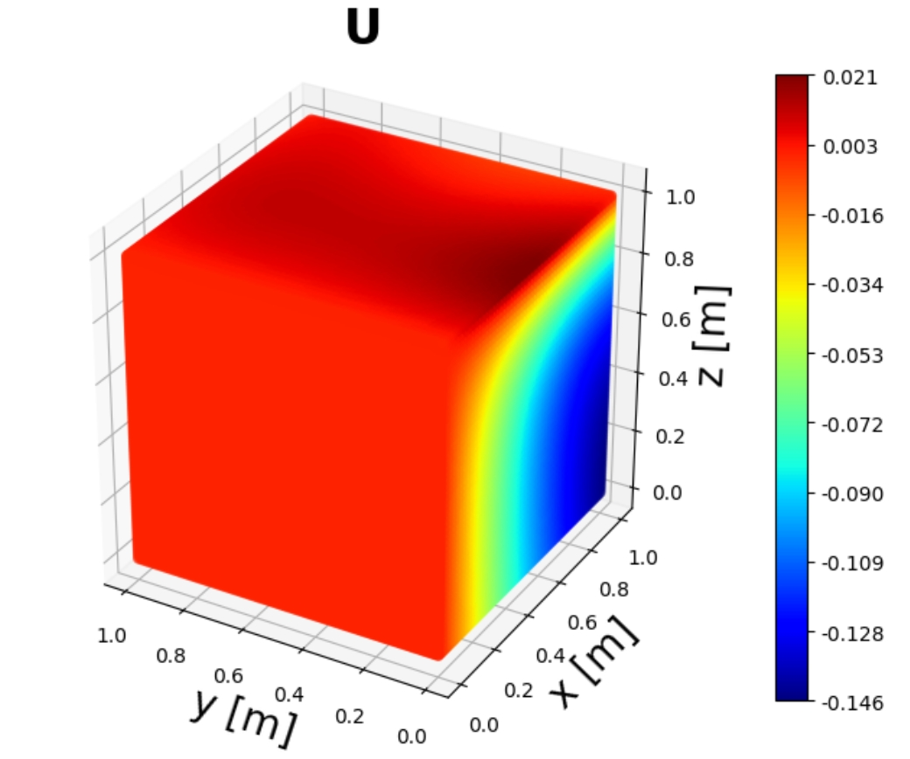
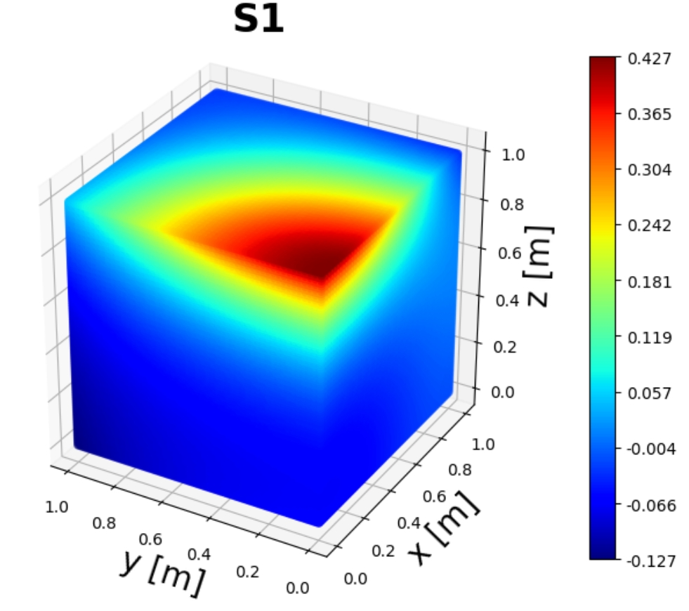
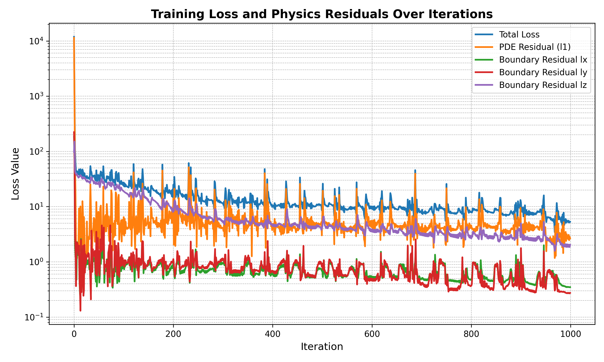
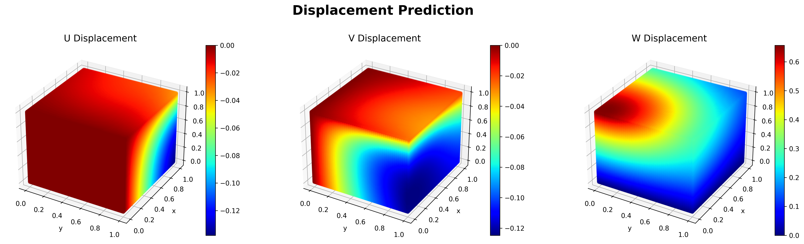
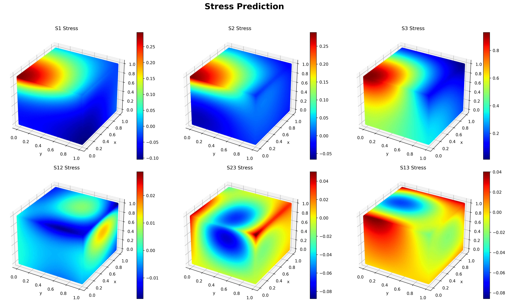

# ElasticPINN3D：三维弹性力学应力与位移预测

[](https://www.python.org/)
[](https://pytorch.org/)
[](https://numpy.org/)
[](https://matplotlib.org/)
[](https://github.com/tqdm/tqdm)
[](https://www.scipy.org/)

## 目录

- [项目概述](#项目概述)
- [环境依赖](#环境与依赖)
- [快速安装](#快速安装)
- [数学背景](#数学背景)
  - [物理公式约束](#物理约束)
  - [Material 函数](#material-函数)
  - [PINN 损失函数](#pinn-损失函数)
    - [PDE 残差损失](#pde-残差损失)
    - [边界应力损失](#边界应力损失-boundary-stress-loss)

- [代码结构](#代码结构)
  - [导入库及设置设备](#代码单元-1导入必要库设置设备)
  - [构造Material 函数](#代码单元-2构造material-函数)
  - [定义 MLP 子网络](#代码单元-3定义-mlp-子网络)
  - [`CustomerDataset` 构造函数](#代码单元-4构造-customerdataset-函数)
  - [`MultiFNN` 构造函数](#代码单元-5-multifnn-class-构造函数)
  - [数据加载](#代码单元-6-load_data-函数)
  - [`train_model`函数](#代码单元-7-train_model-函数)
  - [模型保存与加载](#代码单元-8-模型保存与加载)
  - [物理评估函数](#代码单元-9-物理损失评估函数)
  - [损失函数曲线](#代码单元-10-绘制损失曲线)
  - [位移云图预测](#代码单元-11-绘制位移云图)
  - [应力云图预测](#代码单元-12-绘制应力云图)
- [MultiFNN 网络模型](#multifnn-网络模型)
  - [构造基本的 `MLP` 子网络](#构造基本的-mlp-子网络)
  - [构造 `CustomDataset` 数据集](#构造-customdataset-数据集)
  - [构造`MultiFNN`类](#构造-multifnn-网络模型)
    - [`__init__`: 构造函数](#1-__init__-构造函数)
    - [分量预测方法：`u_model`, `v_model`, `w_model`](#2-分量预测方法u_model-v_model-w_model)
    - [自动微分 `compute_derivative`](#3-自动微分compute_derivatives)
    - [前向传播与损失计算 `forward`](#4-前向传播与损失计算forward)
    - [使用 `predict` 进行全域位移推理](#5-使用-predict-进行全域位移推理)
    - [使用 `predict_stress` 进行应力/残差推理](#6-使用-predict_stress-进行应力残差推理)
- [模型训练与评估](#模型训练与评估)
  - [训练函数](#训练函数)
  - [模型评估](#模型评估)
    - [物理评估指标](#物理评估指标) 
    - [损失曲线](#损失曲线) 
- [三维结果可视化](#三维结果可视化)
  - [位移云图](#位移云图)
  - [应力云图](#应力云图)
- [构建主函数](#主函数与数据加载)
- [脚本化代码](#脚本化代码)  
- [贡献与许可证](#贡献与许可证)


## 项目概述

准确预测固体结构在受力情况下的内部应力与变形，对于确保工程结构（如桥梁、航空航天部件、机械零件等）的安全可靠运行和优化设计至关重要。结构的响应行为通常由弹性力学偏微分方程描述。当结构几何、载荷或边界条件复杂时，求解这些方程可能非常具有挑战性。

本项目致力于应用**物理信息神经网络 (PINN)** 技术，求解一个定义在三维域内的线性弹性力学问题。目标是预测该域内任意点的位移场 (u, v, w) 以及相应的应力张量 (σ) 分布。PINN 的核心思想是将控制物理定律（在此为 **Navier-Cauchy 弹性力学方程**）和边界条件直接嵌入到神经网络的损失函数中进行训练。

**下面图示展示了 PINN 预测结果**

|  |  |
|:--:|:--:|
| **Fig.1** Z 方向位移云图  | **Fig.2** σ<sub>zz</sub> 应力云图  |

- **Fig.1**：展示了在特定边界条件下，结构 Z 方向位移 $w$ 的云图分布。  
- **Fig.2**：展示了对应条件下，结构 σ<sub>zz</sub> 应力分量的云图分布。  


本文通过构建一个包含三个独立子网络（分别对应 u, v, w 位移）的 PINN 模型，利用 PyTorch 的自动微分功能计算位移对空间坐标的各阶导数，进而计算应变、应力以及物理方程的残差。模型的损失函数包含两部分：(1) 内部域点上 Navier-Cauchy 方程的残差；(2) 边界点上应力边界条件的误差。通过最小化总损失，驱动神经网络学习满足物理约束的解。
模型的损失函数由以下两部分组成（具体数学公式请参见 [数学背景](#数学背景) 章节）：

- 🔷 **内域 PDE 残差 (Interior PDE Residual)**  
  测量 PINN 解在内部采样点上对 Navier-Cauchy 弹性力学方程的满足程度。

- 🔷 **边界应力误差 (Boundary Stress Error)**  
  测量预测的应力张量在边界点与给定应力边界条件的偏差。

通过同时最小化这两部分损失，驱动网络满足 PDE 与边界条件的物理约束。  
PINN 方法结合了物理定律的先验知识与神经网络强大的函数逼近能力，能够在无需生成复杂网格、仅依赖域内和边界采样点的情况下，提供连续且可微分的位移和应力场预测，为复杂弹性力学问题的求解和结构分析提供了有潜力的新途径。


## 环境与依赖

- Python ≥3.8
- PyTorch ≥1.12
- NumPy ≥1.21
- Matplotlib ≥3.5
- tqdm ≥4.50.0
- SciPy ≥1.7.0


以上依赖可通过 `requirements.txt` 一键安装：
```bash
pip install -r requirements.txt
```
## 快速安装
```bash
# 建议使用虚拟环境
conda create -n ElasticPINN3D python=3.9
conda activate ElasticPINN3D
pip install -r requirements.txt
```
在本教程的 Notebook 中，我们将逐步定义所需函数并构造基于纯物理约束的 PINNs 网络模型。请在 **Jupyter Notebook** 中依次运行以下代码块：
#### 代码单元 1：导入必要库&设置设备
```python
import torch
import torch.nn as nn
import torch.optim as optim
from torch.utils.data import Dataset, DataLoader
import numpy as np
import matplotlib.pyplot as plt
from tqdm import tqdm
import scipy.io
from mpl_toolkits.mplot3d import Axes3D
import gc
# 设置设备
device = torch.device("cuda:0" if torch.cuda.is_available() else "cpu")
print(f"使用设备: {device}")
```
## 数学背景

在工程结构分析和材料科学领域，描述材料在受力下的微小变形和应力分布是设计和安全评估的核心。例如，桥梁在荷载下的应力分布、航空航天部件的机翼变形，以及机械零件在运转过程中的疲劳分析，都离不开对弹性力学基本原理的掌握。本节将介绍本项目中求解三维弹性力学问题所需的主要数学概念，为后续实现提供理论支撑。

### 物理约束
1. **拉梅常数 (Lamé constants)**  
   对于给定的杨氏模量 $E$ 和泊松比 $\nu$，可通过以下公式计算拉梅常数 $\lambda$ 和剪切模量 $G$：  
```math
\lambda = \frac{E\,\nu}{(1+\nu)(1-2\nu)}, \quad G = \frac{E}{2(1+\nu)}.
```
2. **小应变 (Infinitesimal Strain)**
位移场 $(u,v,w)$ 在空间坐标 $x,y,z$ 上的一阶导数 $u_x, u_y, \dots, w_z$ 对应的小应变分量定义为：
```math
\begin{aligned}
\varepsilon_{xx} &= u_x, &
\varepsilon_{yy} &= v_y, &
\varepsilon_{zz} &= w_z, \\[4pt]
\varepsilon_{xy} &= \tfrac12(u_y + v_x), &
\varepsilon_{yz} &= \tfrac12(v_z + w_y), &
\varepsilon_{xz} &= \tfrac12(u_z + w_x).
\end{aligned}
```
3. **线性本构关系 (Hooke’s Law)**
应力张量 $\sigma_{ij}$ 与应变张量 $\varepsilon_{ij}$ 的关系为：
```math
\sigma_{ij} = 2G\,\varepsilon_{ij} + \lambda\,\delta_{ij}\,\mathrm{tr}(\varepsilon),
\quad
\mathrm{tr}(\varepsilon)=\varepsilon_{xx}+\varepsilon_{yy}+\varepsilon_{zz}.

```
4. **静力平衡残差 (Equilibrium Residual)**
无体积力时，静力平衡要求 $ \nabla\!\cdot\!\sigma = 0 $。将其残差写作：

$$Gex = (G + \lambda)\,(u_{xx} + u_{xy} + u_{xz}) + G\,(u_{xx} + u_{yy} + u_{zz})$$
$$Gey = (G + \lambda)\,(v_{xy} + v_{yy} + v_{yz}) + G\,(v_{xx} + v_{yy} + v_{zz})$$  
$$Gez = (G + \lambda)\,(w_{xz} + w_{yz} + w_{zz}) + G\,(w_{xx} + w_{yy} + w_{zz})$$ 

若残差为零，表明该位置满足平衡方程。


#### 物理方程参数说明：

| 参数                                          | 含义                                        | 默认值  |
|:---------------------------------------------:|:-------------------------------------------:|:-------:|
| $u_x, u_y, u_z$                              | 位移分量 **u** 在 **x**, **y**, **z** 方向的一阶导数 | —       |
| $u_xx, u_xy, u_xz, u_yy, u_yz, u_zz$          | 位移分量 **u** 在 **x**, **y**, **z** 方向的二阶导数 | —       |
| $v_x, v_y, v_z$                              | 位移分量 **v** 在 **x**, **y**, **z** 方向的一阶导数 | —       |
| $v_xx, v_xy, v_xz, v_yy, v_yz, v_zz$          | 位移分量 **v** 在 **x**, **y**, **z** 方向的二阶导数 | —       |
| $w_x, w_y, w_z$                              | 位移分量 **w** 在 **x**, **y**, **z** 方向的一阶导数 | —       |
| $w_xx, w_xy, w_xz, w_yy, w_yz, w_zz$          | 位移分量 **w** 在 **x**, **y**, **z** 方向的二阶导数 | —       |
| $E$                                           | 杨氏模量 (Young’s modulus)                  | `1.0`   |
| $\nu$                                           | 泊松比 (Poisson’s ratio)                   | `0.25`  |

---

### Material 函数
首先，为了在 PINNs 中严格满足弹性力学的物理约束，我们构建了一个 `Material` 函数，用于计算位移场的应变、应力以及静力平衡残差，并将其直接嵌入到损失函数中。

请在 **Jupyter Notebook** 中依次运行以下代码块：
#### 代码单元 2：构造Material 函数
```python
def material(u_x, u_y, u_z, u_xx, u_xy, u_xz, u_yy, u_yz,u_zz,
            v_x, v_y, v_z, v_xx, v_xy, v_xz, v_yy, v_yz,v_zz,
            w_x, w_y, w_z, w_xx, w_xy, w_xz, w_yy, w_yz,w_zz, E=1.0, mu=0.25):
    """
    计算材料特性和应力
    
    参数:
        u_x, u_y, ... : 位移的一阶和二阶导数
        E: 杨氏模量
        mu: 泊松比
    
    返回:
        e1, e2, e3, e12, e23, e13: 应变
        s1, s2, s3, s12, s23, s13: 应力
        Gex, Gey, Gez: 平衡方程残差
    """

    # 计算拉梅常数
    la = E * mu / (1 + mu) / (1 - 2 * mu)
    G = E / (1 + mu) / 2

    # 计算应变
    e1 = u_x
    e2 = v_y
    e3 = w_z
    e12 = 0.5 * (u_y + v_x)
    e23 = 0.5 * (w_y + v_z)
    e13 = 0.5 * (u_z + w_x)

    # 计算应力
    s1 = (2 * G + la) * e1 + la * e2 + la * e3
    s2 = (2 * G + la) * e2 + la * e1 + la * e3
    s3 = (2 * G + la) * e3 + la * e1 + la * e2
    s12 = 2 * G * e12
    s23 = 2 * G * e23
    s13 = 2 * G * e13

    # 计算平衡方程残差
    Gex = (G + la) * (u_xx + v_xy + w_xz) + G * (u_xx + u_yy + u_zz)
    Gey = (G + la) * (v_yy + u_xy + w_yz) + G * (v_xx + v_yy + v_zz)
    Gez = (G + la) * (w_zz + u_xz + v_yz) + G * (w_xx + w_yy + w_zz)

    return e1, e2, e3, e12, e23, e13, s1, s2, s3, s12, s23, s13, Gex, Gey, Gez
```

--- 

### PINN 损失函数

为了将上述物理约束嵌入到神经网络训练中，我们在损失函数中分别引入 PDE 残差和边界应力残差两部分。

#### PDE 残差损失  
对应静力平衡残差 $(r_x,r_y,r_z)=\nabla\!\cdot\!\sigma$，我们对所有内部采样点累加平方和：
```math
L_{\rm PDE}
= \sum_{(x,y,z)\in\Omega_{\rm int}}
  \bigl(r_x^2 + r_y^2 + r_z^2\bigr)
= \sum_{(x,y,z)\in\Omega_{\rm int}}
  \bigl(Gex^2 + Gey^2 + Gez^2\bigr).
```
#### 边界应力损失 (Boundary Stress Loss)

为了让 PINN 同时满足 **零牵引力边界条件** 和 **指定牵引力分布**，我们将边界损失分为三部分：

- **$l_x$（沿 $x$ 面的零牵引力）**  
对应上表面 $x=1$ 和下表面 $x=0$ 的切向应力分量最小化:

    $$
    l_x= \sum_{(x,y,z)\in\partial\Omega_{x=1}} \bigl(s_{11}^{1u\,2} + s_{12}^{1u\,2} + s_{13}^{1u\,2}\bigr) + \sum_{(x,y,z)\in\partial\Omega_{x=0}} \bigl(s_{12}^{1b\,2}+s_{13}^{1b\,2}\bigr)
    $$ ,

该项强制: $\sigma_{11}=\sigma_{12}=\sigma_{13}=0，(T_x=T_y=T_z=0)$

- **$l_y$（沿 $y$ 面的零牵引力）**  
对应上表面 $y=1$ 和下表面 $y=0$ 的切向应力分量最小化:

    $$
    l_y= \sum_{(x,y,z)\in\partial\Omega_{y=1}} \bigl(s_{12}^{2u\,2} + s_{22}^{2u\,2} + s_{23}^{2u\,2}\bigr) + \sum_{(x,y,z)\in\partial\Omega_{y=0}} \bigl(s_{12}^{2b\,2} + s_{23}^{2b\,2}\bigr)
    $$ ,

该项强制: $\sigma_{12}=\sigma_{22}=\sigma_{23}=0$

- **$l_z$（沿 $z$ 面的指定牵引力与零切向应力）**  
对上表面 $z=1$ 施加非零目标分布 $y$（在 `CustomDataset` 中由余弦函数生成），同时在上下表面消除切向应力:

    $$
    l_z = \sum_{(x,y,1)\in\partial\Omega_{z=1}} \Bigl((s_{33}^{3u} - y)^2 \;+\; s_{23}^{3u\,2} \;+\; s_{13}^{3u\,2}\Bigr) + \sum_{(x,y,0)\in\partial\Omega_{z=0}} \Bigl(s_{23}^{3b\,2} \;+\; s_{13}^{3b\,2}\Bigr)
    $$

其中：

- $\displaystyle \sum \bigl(s_{33}^{3u} - y\bigr)^2$  
  强制 $\sigma_{33} = y$（指定 $T_z$）。

- $\displaystyle \sum \bigl(s_{23}^{*2} + s_{13}^{*2}\bigr)$  
  强制 $\sigma_{xz} = \sigma_{yz} = 0$。

#### 边界损失符号说明：

| 符号              | 含义                                                                 |
|:-----------------:|:--------------------------------------------------------------------:|
| $s_{ij}$        | 第 $i,j$ 分量的应力张量 $\sigma_{ij}$                            |
| 上标 $1u,1b$    | “1” 表示 $x$ 方向边界(第 1 个平面), $u$ 表示上表面 $x=1$, $b$ 表示下表面 $x=0$ |
| 上标 $2u,2b$    | “2” 表示 $y$ 方向边界(第 2 个平面), $u$ 上表面 $y=1$, $b$ 下表面 $y=0$   |
| 上标 $3u,3b$    | “3” 表示 $z$ 方向边界(第 3 个平面), $u$ 上表面 $z=1$, $b$ 下表面 $z=0$   |
| $y$             | 在上表面 $z=1$ 的目标法向应力分布（由 `CustomDataset.s3u1` 中的余弦函数生成） |

> 💡 **说明：**  
> - 下标 $i$ 和 $j$ 表示应力张量的分量方向；  
> - 上标" $nu$ "/" $nb$ "中的数字 $n=1,2,3$ 对应 $x,y,z$ 三个主方向，字母 $u/b$ 分别代表上/下表面；  
> - 在 $l_z$ 中, $\sum (s_{33}^{3u}-y)^2$ 强制 $\sigma_{33}=y$ ，  
>   $\sum(s_{23}^{*2}+s_{13}^{*2})$强制 $\sigma_{xz}=\sigma_{yz}=0$ .


## MultiFNN 网络模型
`MultiFNN` 是一个三维物理信息神经网络（PINN）模型的封装，专门用于预测结构在受力情况下的位移和应力分布。该模型包含三个独立的子网络，分别对应位移分量 $u$ , $v$ 和 $w$，并通过自动微分和物理约束实现高精度预测。

`MultiFNN` 的核心功能包括：
1. **分别预测** 三个分量的位移场  
2. **自动微分** 计算位移场的一阶和二阶导数  
3. **调用材料模型** (`material`) 计算应力张量和静力平衡残差  
4. **结合内部域和平面边界** 共同构成损失函数并驱动网络训练  


### 构造基本的 MLP 子网络 
在这一代码单元中，我们定义了一个通用的多层感知机（MLP）子网络，用作 `MultiFNN` 模型中各位移分量的基础回归器。主要特点包括：

- **可配置层次**：通过传入 `layers` 列表控制每一层的神经元数量；  
- **Tanh 激活**：在每对全连接层之间插入 `nn.Tanh()`，以引入非线性；  
- **线性输出层**：最后一层不使用激活，直接输出网络预测值；  
- **Xavier/Glorot 初始化**：对所有 `nn.Linear` 层的权重使用 `xavier_normal_`，偏置初始化为零，确保训练初期信号在网络中稳定传播。

在 `forward` 方法中，将输入 `x` 依次通过上述层序列，得到对应子网络的输出。  

请在 **Jupyter Notebook** 中依次运行以下代码块：
#### 代码单元 3：定义 MLP 子网络

```python
class MLP(nn.Module):
    """
    Multi-layer perceptron with tanh activation
    """
    def __init__(self, layers):
        super(MLP, self).__init__()
        
        modules = []
        for i in range(len(layers)-2):
            modules.append(nn.Linear(layers[i], layers[i+1]))
            modules.append(nn.Tanh())
        modules.append(nn.Linear(layers[-2], layers[-1]))
        
        self.net = nn.Sequential(*modules)
        
        # Xavier/Glorot 初始化
        for m in self.modules():
            if isinstance(m, nn.Linear):
                nn.init.xavier_normal_(m.weight)
                nn.init.zeros_(m.bias)
    
    def forward(self, x):
        return self.net(x)
```

### 构造 `CustomDataset` 数据集

在 PINN 训练中，我们需要同时管理内部域采样点和多种边界条件点，并在每次迭代时随机抽取一批内部点用于 PDE 残差计算，同时将所有边界点用于边界损失计算。`CustomDataset` 类封装了以下功能：

- **内部采样点 (`x`)**：用于计算 PDE 残差  
- **边界条件点 (`x1u`, `x1b`, `x2u`, `x2b`, `x3u`, `x3b`)**：分别对应不同边界面上的坐标  
- **目标值计算**：在 `x3u` 上预先计算好了边界解析解或边界函数 `s3u1`  
- **批量随机抽样**：在 `__getitem__` 中随机打乱内部点并抽取 `batch_size` 个，用于内部域残差；所有边界点一次性返回  
- **设备迁移**：自动将数据搬到指定的 `device` 上，方便后续模型训练  
最终，`__getitem__` 会返回一个元组：
```
(x_batch, x1u, x1b, x2u, x2b, x3u, x3b, y_batch)
```
其中 `x_batch` 用于内部 PDE 计算，`x1u···x3b` 用于边界损失，`y_batch` 为对应的边界目标值。

请在 **Jupyter Notebook** 中依次运行以下代码块：
#### 代码单元 4： `CustomerDataset` 构造函数
```python
class CustomDataset(Dataset):
    def __init__(self, x, x1u, x1b, x2u, x2b, x3u, x3b,batch_size):
        """
        弹性力学问题的数据集
        
        参数:
            x: 内部点坐标
            x1u, x1b, x2u, x2b, x3u, x3b: 边界点坐标
        """
        self.x = torch.tensor(x, dtype=torch.float32).to(device)
        self.x1u = torch.tensor(x1u, dtype=torch.float32).to(device)
        self.x1b = torch.tensor(x1b, dtype=torch.float32).to(device)
        self.x2u = torch.tensor(x2u, dtype=torch.float32).to(device)
        self.x2b = torch.tensor(x2b, dtype=torch.float32).to(device)
        self.x3u = torch.tensor(x3u, dtype=torch.float32).to(device)
        self.x3b = torch.tensor(x3b, dtype=torch.float32).to(device)
        self.batch_size = batch_size

        # 计算目标值
        self.s3u1 = torch.cos(self.x3u[:, 0] / 2 * np.pi) * torch.cos(self.x3u[:, 1] / 2 * np.pi)
        self.s3u1 = self.s3u1.to(device)
        
        self.N = x.shape[0]
    def __len__(self):
        return self.N
    
    def __getitem__(self, idx):
        indices = torch.randperm(self.N, device=self.x.device)[:self.batch_size]
        x_batch = self.x[indices]
        y_batch = self.s3u1

        return x_batch, self.x1u, self.x1b, self.x2u, self.x2b, self.x3u, self.x3b,y_batch 
```
### 构造 MultiFNN 网络模型

在完成了基础的 MLP 子网络定义和 `CustomDataset` 的数据准备后，下面我们将这些模块整合到 `MultiFNN` 类中，逐步展示如何：

1. 在 `__init__` 中初始化三个独立的子网络；  
2. 通过 `u_model`/`v_model`/`w_model` 实现分量级位移预测；  
3. 利用自动微分在 `compute_derivatives` 中计算所需导数；  
4. 在 `forward` 方法里组合内部域残差与边界应力损失；  
5. 调用 `predict` 与 `predict_stress` 完成批量推理。

通过这一系列步骤，你将看到如何在 PyTorch 中基于纯物理约束构建并应用三维弹性力学的 PINN 模型。

首先请在 **Jupyter Notebook** 中创建一个新的代码块用来构造`MultiFNN`类：
#### 1. `__init__`: 构造函数

初始化三个子网络 MLP 用于 $ u, v, w $，并将它们搬到指定 device；设置损失日志

---

请在 **MultiFNN** 代码块中输入以下代码：
#### 代码单元 5： `MultiFNN Class` 构造函数
```python
class MultiFNN(nn.Module):
    """
    物理信息神经网络，包含三个子网络分别用于 u, v, w 分量
    """
    def __init__(self, layers):
        super(MultiFNN, self).__init__()
        
        # 为每个分量创建子网络
        self.u_net = MLP(layers).to(device)
        self.v_net = MLP(layers).to(device)
        self.w_net = MLP(layers).to(device)
        
        # 日志记录器
        self.loss_log = []
        self.loss_res_log = []
```

#### 2. 分量预测方法：`u_model`, `v_model`, `w_model`
- **输入**: 坐标张量 `x, y, z`  
- **处理**:  
  -   拼接成 $(x,y,z)$  
  -   前向 MLP，输出标量  
  -   `squeeze` 降维  
  -   乘以对应坐标（满足边界/物理约束）
  
---
请在 **MultiFNN** 代码块中继续输入以下代码 ：
```python 
    def u_model(self, x, y, z):
        """u分量模型"""
        # 检查输入形状
        inputs = torch.stack([x, y, z], dim=-1)
        # 确保形状匹配避免广播
        output = self.u_net(inputs)
        output = output.squeeze(-1)
        return output * x
    
    def v_model(self, x, y, z):
        """v分量模型"""
        # 检查输入形状
        inputs = torch.stack([x, y, z], dim=-1)
        # 确保形状匹配避免广播
        output = self.v_net(inputs)
        output = output.squeeze(-1)
        return output * y
    
    def w_model(self, x, y, z):
        """w分量模型"""
        # 检查输入形状
        inputs = torch.stack([x, y, z], dim=-1)
        # 确保形状匹配避免广播
        output = self.w_net(inputs)
        output = output.squeeze(-1)
        return output * z  
```
#### 3. 自动微分：`compute_derivatives`

- 将坐标 `x, y, z` 设为可微分  
- 计算输出 $u, v, w$ 的一阶、二阶空间导数  
- 返回所有 27 个导数:

$$u_x, u_y, u_z, u_{xx}, u_{xy}, u_{xz}, u_{yy}, u_{yz}, u_{zz}, \quad v_x, v_y, \dots, v_{zz}, \quad w_x, \dots, w_{zz}$$

---

为实现`compute_derivatives`函数，请在 **MultiFNN** 代码块中继续输入以下代码 ：
```python
def compute_derivatives(self, x, y, z):
        """使用自动微分计算所需的导数"""
        # 使坐标需要梯度
        x.requires_grad_(True)
        y.requires_grad_(True)
        z.requires_grad_(True)

        # 前向传播
        u = self.u_model(x, y, z)
        v = self.v_model(x, y, z)
        w = self.w_model(x, y, z)
        
        # 一阶导数
        u_x = torch.autograd.grad(u, x, grad_outputs=torch.ones_like(u), create_graph=True)[0]
        u_y = torch.autograd.grad(u, y, grad_outputs=torch.ones_like(u), create_graph=True)[0]
        u_z = torch.autograd.grad(u, z, grad_outputs=torch.ones_like(u), create_graph=True)[0]
        
        v_x = torch.autograd.grad(v, x, grad_outputs=torch.ones_like(v), create_graph=True)[0]
        v_y = torch.autograd.grad(v, y, grad_outputs=torch.ones_like(v), create_graph=True)[0]
        v_z = torch.autograd.grad(v, z, grad_outputs=torch.ones_like(v), create_graph=True)[0]
        
        w_x = torch.autograd.grad(w, x, grad_outputs=torch.ones_like(w), create_graph=True)[0]
        w_y = torch.autograd.grad(w, y, grad_outputs=torch.ones_like(w), create_graph=True)[0]
        w_z = torch.autograd.grad(w, z, grad_outputs=torch.ones_like(w), create_graph=True)[0]
        
        # 二阶导数
        u_xx = torch.autograd.grad(u_x, x, grad_outputs=torch.ones_like(u_x), create_graph=True)[0]
        u_xy = torch.autograd.grad(u_x, y, grad_outputs=torch.ones_like(u_x), create_graph=True)[0]
        u_xz = torch.autograd.grad(u_x, z, grad_outputs=torch.ones_like(u_x), create_graph=True)[0]
        
        u_yy = torch.autograd.grad(u_y, y, grad_outputs=torch.ones_like(u_y), create_graph=True)[0]
        u_yz = torch.autograd.grad(u_y, z, grad_outputs=torch.ones_like(u_y), create_graph=True)[0]
        u_zz = torch.autograd.grad(u_z, z, grad_outputs=torch.ones_like(u_z), create_graph=True)[0]
        
        v_xx = torch.autograd.grad(v_x, x, grad_outputs=torch.ones_like(v_x), create_graph=True)[0]
        v_xy = torch.autograd.grad(v_x, y, grad_outputs=torch.ones_like(v_x), create_graph=True)[0]
        v_xz = torch.autograd.grad(v_x, z, grad_outputs=torch.ones_like(v_x), create_graph=True)[0]
        
        v_yy = torch.autograd.grad(v_y, y, grad_outputs=torch.ones_like(v_y), create_graph=True)[0]
        v_yz = torch.autograd.grad(v_y, z, grad_outputs=torch.ones_like(v_y), create_graph=True)[0]   
        v_zz = torch.autograd.grad(v_z, z, grad_outputs=torch.ones_like(v_z), create_graph=True)[0]
        
        w_xx = torch.autograd.grad(w_x, x, grad_outputs=torch.ones_like(w_x), create_graph=True)[0]
        w_xy = torch.autograd.grad(w_x, y, grad_outputs=torch.ones_like(w_x), create_graph=True)[0]
        w_xz = torch.autograd.grad(w_x, z, grad_outputs=torch.ones_like(w_x), create_graph=True)[0]
        
        w_yy = torch.autograd.grad(w_y, y, grad_outputs=torch.ones_like(w_y), create_graph=True)[0]
        w_yz = torch.autograd.grad(w_y, z, grad_outputs=torch.ones_like(w_y), create_graph=True)[0]   
        w_zz = torch.autograd.grad(w_z, z, grad_outputs=torch.ones_like(w_z), create_graph=True)[0]
         
        return (u_x, u_y, u_z, u_xx, u_xy, u_xz, u_yy, u_yz, u_zz,
                v_x, v_y, v_z, v_xx, v_xy, v_xz, v_yy, v_yz, v_zz,
                w_x, w_y, w_z, w_xx, w_xy, w_xz, w_yy, w_yz, w_zz)
```

#### 4. 前向传播与损失计算：`forward`

在 `forward` 方法中，我们首先计算内部域的平衡方程残差，然后对各个边界面的应力偏差进行评估，最后将它们组合成总损失并返回。

-   **内部域残差**  
通过自动微分得到的静力平衡残差分量 \(Gex, Gey, Gez\)，其损失定义为：  

  $$l1 = \sum \bigl(Gex^2 + Gey^2 + Gez^2\bigr)$$

（参见 [数学背景](#数学背景) 中的静力平衡残差定义）


- **边界应力损失**  

  - **$l_x$**：沿 $x$ 平面上下表面的应力残差  

$$    l_x = \sum\bigl(s_{11}^{1u\,2} + s_{12}^{1u\,2} + s_{13}^{1u\,2}
                   + s_{12}^{1b\,2} + s_{13}^{1b\,2}\bigr)$$
  

  - **$l_y$**：沿 $y$ 平面上下表面的应力残差  

$$    l_y = \sum\bigl(s_{22}^{2u\,2} + s_{12}^{2u\,2} + s_{23}^{2u\,2}
                   + s_{12}^{2b\,2} + s_{23}^{2b\,2}\bigr)$$

  - **$l_z$**：沿 $z$ 平面上下表面的应力残差（包含已知载荷 $y$）  

$$    l_z = \sum\bigl((s_{33}^{3u} - y)^2 + s_{23}^{3u\,2} + s_{13}^{3u\,2}
                   + s_{23}^{3b\,2} + s_{13}^{3b\,2}\bigr)$$

-  **总损失**  
最终将内部域残差与所有边界应力损失相加，得到模型的总损失函数：


$$\mathcal{L} = l_1 + l_x + l_y + l_z$$

该组合损失函数既约束了内部的静力平衡，也保证了边界应力条件的精度，具体数学推导请参考 [数学背景](#数学背景) 章节。

---

为实现`forward`函数，请在 **MultiFNN** 代码块中继续输入以下代码：
```python
    def forward(self, batch):
        """前向传播计算损失分量"""
        x, x1u, x1b, x2u, x2b, x3u, x3b, y = batch
        # 内部域
        a, b, c = x[ :,0], x[ :,1], x[:,2]
        # 计算内部点的导数

        derivs = self.compute_derivatives(a, b, c)
    
        # 获取材料残差
        _, _, _, _, _, _, _, _, _, _, _, _, Gex, Gey, Gez = material(*derivs)

        
        # 计算边界导数 - x-y-z平面 Up/Bottom
        a1u, b1u, c1u = x1u[:, 0], x1u[ :,1], x1u[:, 2]
        a1b, b1b, c1b = x1b[:, 0], x1b[ :,1], x1b[:, 2]
        a2u, b2u, c2u = x2u[:, 0], x2u[:, 1], x2u[:, 2]
        a2b, b2b, c2b = x2b[:, 0], x2b[:, 1], x2b[:,2]
        a3u, b3u, c3u = x3u[:, 0], x3u[:, 1], x3u[:,2]
        a3b, b3b, c3b = x3b[ :,0], x3b[ :,1], x3b[:,2]
        
        # 计算边界点的导数
        derivs_1u = self.compute_derivatives(a1u, b1u, c1u)
        derivs_1b = self.compute_derivatives(a1b, b1b, c1b)
        derivs_2u = self.compute_derivatives(a2u, b2u, c2u)
        derivs_2b = self.compute_derivatives(a2b, b2b, c2b)
        derivs_3u = self.compute_derivatives(a3u, b3u, c3u)
        derivs_3b = self.compute_derivatives(a3b, b3b, c3b)
        
        # 获取每个边界的材料特性
        _, _, _, _, _, _, s11u, _, _, s121u, _, s131u, _, _, _ = material(*derivs_1u)
        _, _, _, _, _, _, _, _, _, s121b, _, s131b, _, _, _ = material(*derivs_1b)
        _, _, _, _, _, _, _, s22u, _, s122u, s232u, _, _, _, _ = material(*derivs_2u)
        _, _, _, _, _, _, _, _, _, s122b, s232b, _, _, _, _ = material(*derivs_2b)
        _, _, _, _, _, _, _, _, s33u, _, s233u, s133u, _, _, _ = material(*derivs_3u)
        _, _, _, _, _, _, _, _, _, _, s233b, s133b, _, _, _ = material(*derivs_3b)
        # 计算损失
        l1 = torch.sum(Gex**2) + torch.sum(Gey**2) + torch.sum(Gez**2)
        
        lx = (torch.sum(s11u**2) + torch.sum(s121u**2) + torch.sum(s131u**2) + 
              torch.sum(s121b**2) + torch.sum(s131b**2))
        
        ly = (torch.sum(s22u**2) + torch.sum(s122u**2) + torch.sum(s232u**2) + 
              torch.sum(s122b**2) + torch.sum(s232b**2))
        
        lz = (torch.sum((s33u-y)**2) + torch.sum(s233u**2) + torch.sum(s133u**2) + 
              torch.sum(s233b**2) + torch.sum(s133b**2))
        
        l2 = lx + ly + lz
        
        # 总损失
        loss = l1 + l2
        
        return l1, lx, ly, lz, loss
``` 
#### 5. 使用 `predict` 进行全域位移推理
在实际应用中，我们常常需要对海量空间点一次性获得位移预测，而不是只看训练损失的数值。所以我们需要在`MultiFNN`类中构造`predict`方法进行位移预测来进行后续的模型评估工作。

---

为实现`predict`函数，请在 **MultiFNN** 代码块中继续输入以下代码：
```python
    def predict(self, x_coords, batch_size=9261):
        n_samples = x_coords.shape[0]
        u_result = np.zeros(n_samples)
        v_result = np.zeros(n_samples)
        w_result = np.zeros(n_samples)
        bs = int(batch_size)
        for i in range(0, n_samples, bs):
            end = min(i + bs, n_samples)
            x_batch = x_coords[i:end]
            x = torch.tensor(x_batch[:, 0], dtype=torch.float32).to(device)
            y = torch.tensor(x_batch[:, 1], dtype=torch.float32).to(device)
            z = torch.tensor(x_batch[:, 2], dtype=torch.float32).to(device)

            with torch.no_grad():
                u = self.u_model(x, y, z)
                v = self.v_model(x, y, z)
                w = self.w_model(x, y, z)


                assert u.shape[0] == (end - i)
                assert v.shape[0] == (end - i)
                assert w.shape[0] == (end - i)

                u_result[i:end] = u.cpu().numpy()
                v_result[i:end] = v.cpu().numpy()
                w_result[i:end] = w.cpu().numpy()

            del u, v, w, x, y, z

        return u_result, v_result, w_result
```
> 💡 **解读：**
> - **功能**：对一组三维坐标批量推理位移，直接输出 NumPy 数组形式的 $u,v,w$。  
> - **输入参数**：  
>   - `x_coords`: $N \times 3$ 坐标数组。  
>   - `batch_size`：单次推理的最大样本数（默认 $9261$）。  
> - **核心流程**：  
>   1. **预分配**：`u_result, v_result, w_result` 长度均为 $N$ 的零数组。  
>   2. **分批处理**：按 `batch_size` 切片并转换为张量；在 `torch.no_grad()` 下调用 `u_model/v_model/w_model` 得到预测，再 `.cpu().numpy()` 回写。  
>   3. **健壮性**：使用 `assert` 校验每批输出与输入点数一致，防止索引错误。  
>   4. **清理**：`del` 本批次临时张量，并可选 `torch.cuda.empty_cache()` 释放显存。  
> - **返回值**：三条形如 `(N,)` 的 NumPy 数组，分别对应 $u,v,w$ 位移分量。  

> 🔍 **提示：**
> - 根据可用显存/内存调整 `batch_size`；显存充足时可加大批量，否则适当减小。  
> - 推理阶段不会修改模型参数，可反复用于不同网格或后处理分析。  

#### 6. 使用 `predict_stress` 进行应力/残差推理

在实际应用中，我们不仅需要对海量点集进行位移场推理，还常常需要在同一批处理流程中，分别计算每个点的 **应变**、**应力** 以及 **静力平衡残差**。因此，我们在 `MultiFNN` 类中添加了 `predict_stress` 方法，以批处理方式一次性返回 15 个物理量（6 个应变、6 个应力、3 个残差）的 NumPy 数组，方便后续的物理场可视化和误差评估。

---  
为实现`predict_stress`函数，请在 **MultiFNN** 代码块中继续输入以下代码：
```python
    def predict_stress(self, x_coords, batch_size=9261):
        """使用批处理方式预测应力，避免内存溢出"""

        num_points = x_coords.shape[0]
        # 计算需要的批次数量
        num_batches = (num_points + batch_size - 1) // batch_size

        # 预先分配存储结果的 NumPy 数组
        # 假设应变和应力是单个浮点数值，形状与输入点数相同
        # 如果它们是张量或有其他维度，请调整 shape
        e1_results = np.empty(num_points, dtype=np.float32)
        e2_results = np.empty(num_points, dtype=np.float32)
        e3_results = np.empty(num_points, dtype=np.float32)
        e12_results = np.empty(num_points, dtype=np.float32)
        e23_results = np.empty(num_points, dtype=np.float32)
        e13_results = np.empty(num_points, dtype=np.float32)
        s1_results = np.empty(num_points, dtype=np.float32)
        s2_results = np.empty(num_points, dtype=np.float32)
        s3_results = np.empty(num_points, dtype=np.float32)
        s12_results = np.empty(num_points, dtype=np.float32)
        s23_results = np.empty(num_points, dtype=np.float32)
        s13_results = np.empty(num_points, dtype=np.float32)
        gx_results = np.empty(num_points, dtype=np.float32)
        gy_results = np.empty(num_points, dtype=np.float32)
        gz_results = np.empty(num_points, dtype=np.float32)


        # 循环处理每个批次
        for i in range(num_batches):
            start_idx = i * batch_size
            end_idx = min((i + 1) * batch_size, num_points)
            # 提取当前批次的坐标
            x_batch = x_coords[start_idx:end_idx, :]

            # 将当前批次转换为 Tensor 并移动到设备
            # 确保这里只处理 batch_size 个点，而不是整个数据集
            x = torch.tensor(x_batch[:, 0], dtype=torch.float32).to(device)
            y = torch.tensor(x_batch[:, 1], dtype=torch.float32).to(device)
            z = torch.tensor(x_batch[:, 2], dtype=torch.float32).to(device)

            derivs = self.compute_derivatives(x, y, z)           
            e1, e2, e3, e12, e23, e13, s1, s2, s3, s12, s23, s13, gx, gy, gz = material(*derivs)
            # 将当前批次的结果转换为 NumPy 数组并存储到预分配的总结果数组中
            e1_results[start_idx:end_idx] = e1.detach().cpu().numpy().flatten() # .flatten() 如果结果是单值
            e2_results[start_idx:end_idx] = e2.detach().cpu().numpy().flatten()
            e3_results[start_idx:end_idx] = e3.detach().cpu().numpy().flatten()
            e12_results[start_idx:end_idx] = e12.detach().cpu().numpy().flatten()
            e23_results[start_idx:end_idx] = e23.detach().cpu().numpy().flatten()
            e13_results[start_idx:end_idx] = e13.detach().cpu().numpy().flatten()
            s1_results[start_idx:end_idx] = s1.detach().cpu().numpy().flatten()
            s2_results[start_idx:end_idx] = s2.detach().cpu().numpy().flatten()
            s3_results[start_idx:end_idx] = s3.detach().cpu().numpy().flatten()
            s12_results[start_idx:end_idx] = s12.detach().cpu().numpy().flatten()
            s23_results[start_idx:end_idx] = s23.detach().cpu().numpy().flatten()
            s13_results[start_idx:end_idx] = s13.detach().cpu().numpy().flatten()
            gx_results[start_idx:end_idx] = gx.detach().cpu().numpy().flatten()
            gy_results[start_idx:end_idx] = gy.detach().cpu().numpy().flatten()
            gz_results[start_idx:end_idx] = gz.detach().cpu().numpy().flatten()

            # 释放当前批次不再需要的内存
            del x, y, z, derivs, e1, e2, e3, e12, e23, e13, s1, s2, s3, s12, s23, s13, gx, gy, gz
            torch.cuda.empty_cache() # 如果使用 CUDA

        # 返回累积了所有批次结果的 NumPy 数组
        return (e1_results, e2_results, e3_results, e12_results, e23_results, e13_results,
                s1_results, s2_results, s3_results, s12_results, s23_results, s13_results,
                gx_results, gy_results, gz_results)
```

> 💡 **解读：**
> - **功能**：对一组三维坐标批量推理小应变、应力分量及静力平衡残差，共 15 个物理量，输出 NumPy 数组。  
> - **输入参数**：  
>   - `x_coords`: $N \times 3$ 坐标数组。  
>   - `batch_size`：单次处理的最大点数（默认 9261）。  
> - **核心流程**：  
>   1. **预分配缓存**：一次性在 CPU 上为 6 个应变、6 个应力和 3 个残差分量各创建长度为 $N$ 的 NumPy 数组。  
>   2. **分批推理**：按 `batch_size` 切片，转换为张量后调用 `compute_derivatives` 获取导数，再通过 `material` 计算物理量。  
>   3. **结果写入**：将每批次的 15 个张量 `.detach().cpu().numpy().flatten()` 后写入对应缓存区域。  
>   4. **内存清理**：`del` 掉本批次张量，并在 CUDA 环境下可选 `torch.cuda.empty_cache()` 释放显存。  
> - **返回值**：一个包含 15 条形如 `(N,)` 的 NumPy 数组的元组，分别对应小应变、应力和残差分量。


> 🔍 **提示：**
> - 如需更细粒度的后处理，可单独提取所需应力或残差分量进行可视化。  
> - 若发现推理过程中显存不足，可适当调小 `batch_size`；若想加速、且显存充足，可增大批量。  

---

至此，我们完成了 `MultiFNN` 网络模型的搭建与功能实现：  
- 并行的 MLP 子网络用于预测位移分量  
- 物理约束通过自动微分和 `material` 函数嵌入到损失中  
- 批量推理接口 `predict` / `predict_stress` 支持大规模点云的后处理  

---

## 模型训练与评估

接下来，我们将介绍如何在准备好的数据集上配置训练流程、定义损失函数与优化器，并评估模型性能，包括训练损失曲线、$L^2$ 相对误差和物理场可视化等内容。  

### 训练函数
在训练模型之前我们需要构造加载数据函数用以从 $.mat$ 数据文件中获取原始数据，并且我们还需要构建加载测试数据的函数以获取对照测试

请在你的 Notebook 中添加以下 `load_data` 函数和 `load_test_data`函数
#### 代码单元 6： `load_data` 函数

```python
def load_data(file_path='./data/3D_Elasticity.mat'):
    print("加载训练数据...")
    # 加载数据
    C = scipy.io.loadmat(file_path)
    x = C['xy']
    x1u = C['x1u']
    x1b = C['x1b']
    x2u = C['x2u']
    x2b = C['x2b']
    x3u = C['x3u']
    x3b = C['x3b']
    ns = C['n'][0, 0]
    batch_size = ns
    # 创建数据集
    dataset = CustomDataset(x, x1u, x1b, x2u, x2b, x3u, x3b,batch_size)
    return dataset
# 加载测试数据
def load_test_data(file_path='./data/FEA.mat'):
    print("加载测试数据...")
    # 加载测试数据
    test_data = scipy.io.loadmat(file_path)
    test_x = np.array(test_data['X'])
    print(f"测试数据大小: {test_x.shape}")
    return test_x
```

--- 
接下来我们就可以构造`Train_model`函数了。
请在你的 Notebook 中添加以下 `train_model` 函数，用于在 `CustomDataset` 上训练模型并记录训练日志
#### 代码单元 7： `train_model` 函数

```python
def train_model(
    model, dataset, n_iter=10000, lr=1e-2,
    log_interval=10, lr_step=2000, gamma=0.9
):
    """
    训练 MultiFNN 模型

    参数：
        model: MultiFNN 实例
        dataset: CustomDataset，包含内部点和边界点
        n_iter: 总迭代次数
        lr: 初始学习率
        log_interval: 记录损失的步长
        lr_step: 学习率衰减间隔
        gamma: 学习率指数衰减因子
    """
    optimizer = optim.Adam(model.parameters(), lr=lr)
    scheduler = optim.lr_scheduler.ExponentialLR(optimizer, gamma=gamma)

    for it in tqdm(range(1, n_iter + 1)):
        # 随机采样一批数据
        batch = dataset[0]

        # 前向计算损失
        l1, lx, ly, lz, loss = model(batch)

        # 反向传播与优化
        optimizer.zero_grad()
        loss.backward()
        optimizer.step()

        # 每 lr_step 次衰减一次学习率
        if it % lr_step == 0:
            scheduler.step()

        # 日志记录
        if it % log_interval == 0:
            model.loss_log.append(loss.item())
            model.loss_res_log.append(l1.item())
            tqdm.write(
                f"[Iter {it}/{n_iter}] "
                f"loss={loss.item():.3e}, "
                f"l1={l1.item():.3e}, "
                f"lx={lx.item():.3e}, "
                f"ly={ly.item():.3e}, "
                f"lz={lz.item():.3e}"
            )
```


> 💡 **解读：**
> - **Adam 优化器 + 指数衰减**：结合 Adam 的自适应步长和 ExponentialLR，保证训练初期快速下降，后期平滑微调。  
> - **多级日志记录**：`loss_log` 用于跟踪总损失，`loss_res_log` 用于跟踪 PDE 残差，便于后续可视化和模型诊断。  
> - **学习率调度**：通过 `lr_step` 和 `gamma` 控制学习率在训练过程中的指数级衰减，避免收敛过早或陷入局部最优。  
> - **数据采样策略**：当前示例使用 `dataset[0]` 随机抽取子集用于训练，可根据需求切换为 `DataLoader` 以实现更灵活的批次采样。  


此外，在完成`train_model`函数后，我们还需要保存和加载模型的功能函数。

请在你的 Notebook 中添加以下 `save_model` 函数和`load_model`函数

#### 代码单元 8： 模型保存与加载

```python
def save_model(model, filepath='./model/pinn_elasticity_model.pt'):
    """
    模型参数和训练日志
    """
    log_dict = {
        'loss_total':    model.loss_log,
        'loss_pde':      model.loss_res_log,
        'loss_x_bnd':    model.loss_x_log,
        'loss_y_bnd':    model.loss_y_log,
        'loss_z_bnd':    model.loss_z_log
    }

    checkpoint = {
        'model_state': model.state_dict(),
        'logs':        log_dict
    }

    torch.save(checkpoint, filepath)
    print(f"✅ 模型和日志已保存到 {filepath}")
    
    
def load_model(model, filepath='./model/pinn_elasticity_model.pt', device='cpu'):
    """
    从 checkpoint 中加载模型参数及训练日志（按 logs 字段组织）。
    """
    ckpt = torch.load(filepath, map_location=device)
    
    # 恢复模型参数
    model.load_state_dict(ckpt['model_state'])
    model.to(device)
    
    # 恢复日志
    logs = ckpt.get('logs', {})
    model.loss_log      = logs.get('loss_total', [])
    model.loss_res_log  = logs.get('loss_pde', [])
    model.loss_x_log    = logs.get('loss_x_bnd', [])
    model.loss_y_log    = logs.get('loss_y_bnd', [])
    model.loss_z_log    = logs.get('loss_z_bnd', [])
    
    print(f"✅ 已从 {filepath} 加载模型参数和训练日志")
    return model
```


### 模型评估

#### 物理评估指标

由于
本项目采用纯物理约束驱动的 PINNs，在缺乏可参照的标注数据的情况下，就无法计算传统的 L₂ 相对误差。此时，我们使用以下物理残差作为替代评估指标：

- 💡 **平均 PDE 残差** 

对所有内部采样点 $\Omega_{\rm int}$ 计算静力平衡残差分量之和的平均值: 


$$
\bar{r}_{\mathrm{PDE}} = \frac{1}{N_{\mathrm{int}}} \sum_{(x,y,z)\in\Omega_{\mathrm{int}}} \left( |r_x| + |r_y| + |r_z| \right)
$$


其中 $\displaystyle (r_x, r_y, r_z) = \nabla \!\cdot\! \sigma$

---

- 💡 **平均边界残差**  
分别对 $x$, $y$, $z$ 三个方向的边界面，计算应力偏差的平均值：


$$
\bar r_x= \frac{1}{N_{x\mathrm{bnd}}} \sum_{(x,y,z)\in\partial\Omega_x} \bigl|\mathbf{n}\!\cdot\!\sigma - \mathbf{t}_{\mathrm{presc}}\bigr|
$$ 

同理定义: $\bar r_y,\bar r_z$

#### 代码单元 9： 物理损失评估函数
请在你的 Notebook 中添加以下 `evaluate_physics_metrics` 函数，用以评估模型的物理损失特征：

```python
def evaluate_physics_metrics(model, dataset):
    model.eval()
    sum_l1 = sum_lx = sum_ly = sum_lz = sum_loss = 0.0
    count = 0

    for batch in dataset:
        l1, lx, ly, lz, loss = model(batch)
        sum_l1   += l1.item()
        sum_lx   += lx.item()
        sum_ly   += ly.item()
        sum_lz   += lz.item()
        sum_loss += loss.item()
        count    += 1

    # 恢复训练模式
    model.train()

    avg_l1   = sum_l1   / count
    avg_lx   = sum_lx   / count
    avg_ly   = sum_ly   / count
    avg_lz   = sum_lz   / count
    avg_loss = sum_loss / count

    print(f"  • PDE 残差 l1:    {avg_l1:.3e}")
    print(f"  • 边界残差 lx:   {avg_lx:.3e}")
    print(f"  • 边界残差 ly:   {avg_ly:.3e}")
    print(f"  • 边界残差 lz:   {avg_lz:.3e}")
    print(f"  • 总损失 loss:   {avg_loss:.3e}")

    return {
        'avg_l1':   avg_l1,
        'avg_lx':   avg_lx,
        'avg_ly':   avg_ly,
        'avg_lz':   avg_lz,
        'avg_loss': avg_loss
    }
```

示例输出结果:

```bash
 训练日志物理评估：
  平均总损失   : 41.200
  平均 PDE 残差: 24.264
  平均边界残差 lx: 1.847
  平均边界残差 ly: 0.881
  平均边界残差 lz: 14.208
```

>🔍 提示：
> - 这些物理残差指标能直接反映模型对 PDE 和边界条件的满足程度，是纯物理驱动模型的核心评估手段。
> - 若后续获得高精度仿真或实验数据，可再添加 L₂ 误差等常规模型误差度量。

---

#### 损失曲线

在训练过程中，我们通过 `model.loss_log` 和 `model.loss_res_log` 分别记录了总损失与 PDE 残差。可视化这些曲线可以帮助我们判断训练收敛速度、是否出现震荡或过拟合。
#### 代码单元 10： 绘制损失曲线
请在你的 Notebook 中添加以下 `evaluate_physics_metrics` 函数，用以评估模型的物理损失特征：

```python
def loss_curve(model):
    plt.figure(figsize=(10, 6))
    # 绘制各个损失曲线
    plt.plot(model.loss_log,      linewidth=2, label='总损失')
    plt.plot(model.loss_res_log,  linewidth=2, label='PDE 残差 (l1)')
    plt.plot(model.loss_x_log,    linewidth=2, label='边界残差 lx')
    plt.plot(model.loss_y_log,    linewidth=2, label='边界残差 ly')
    plt.plot(model.loss_z_log,    linewidth=2, label='边界残差 lz')

    plt.xlabel('迭代次数', fontsize=12)
    plt.ylabel('Loss 值', fontsize=12)
    plt.title('训练过程中的损失与物理残差曲线', fontsize=14, fontweight='bold')
    plt.yscale('log')
    plt.grid(True, which='both', linestyle='--', linewidth=0.5)
    plt.legend(loc='upper right')
    plt.tight_layout()
    plt.show()
```

<p align="center" id="fig3">
  
  <br/>
  <b>Fig.3</b> 损失曲线示例
</p>

> 🔍 **提示：**  
> - 在同一图中展示所有损失曲线可以直观对比不同物理约束的收敛速度与相互影响。  
> - 使用对数坐标 ($y_{scale}=$'log') 有助于观察早期快速下降和后期微调阶段的细微变化。  
> - 若某条曲线数字级别远高于其他曲线，可考虑对该项损失单独加权或分阶段训练以平衡收敛速度。  

---

## 三维结果可视化

接下来我们将演示如何通过两组函数在 3D 空间中直观展示 PINN 预测的位移场和应力场。
### 位移云图

使用 `plot_displacement` 函数，在一行三列的子图中分别展示 $U$, $V$, $W$ 分量：

#### 代码单元 11： 绘制位移云图
请在你的 Notebook 中添加以下 `plot_displacement` 函数：
```python
def plot_displacement(test_x,model, batch_size=9261,save_path='./viz/predict_displacement.png'):
    """
    对一组三维坐标批量预测并在 1×3 子图中绘制位移云图（u, v, w）
    """
    u, v, w = model.predict(test_x, batch_size=batch_size)
    titles = ['U Displacement', 'V Displacement', 'W Displacement']
    values = [u, v, w]
    fig, axes = plt.subplots(1, 3, figsize=(18, 5), subplot_kw={'projection': '3d'})
    fig.suptitle('Displacement Prediction', fontsize=20, fontweight='bold', y=1.02)
    for ax, vc, title in zip(axes, values, titles):
        vmax, vmin = np.max(vc), np.min(vc)
        im = ax.scatter(test_x[:,1], test_x[:,0], test_x[:,2],
                        c=vc, cmap='jet', vmin=vmin, vmax=vmax)
        ax.set_title(title, fontsize=14)
        ax.set_xlabel('y'); ax.set_ylabel('x'); ax.set_zlabel('z')
        plt.colorbar(im, ax=ax, fraction=0.046, pad=0.04)
    plt.tight_layout()
     # 保存图像
    plt.savefig(save_path, dpi=300, bbox_inches='tight')
    plt.show()
```
在运行模型过程中调用该函数，将会获得如[Fig.4](#fig4)的结果：
<p align="center" id="fig4">
  
  <br/>
  <b>Fig.4</b> 位移预测云图
</p>

### 应力云图
使用 `plot_stress` 函数，在 $2×3$ 网格子图中展示 $6$ 个主要应力分量:
#### 代码单元 12： 绘制应力云图
请在你的 Notebook 中添加以下 `plot_stress` 函数：
```python
def plot_stress(test_x, model, batch_size=9261,save_path='./viz/predict_stress.png'):
    """
    对一组三维坐标批量预测并在 2×3 子图中绘制应力云图
    """
    # predict_stress 返回 (e1,e2,e3,e12,e23,e13,s1,s2,s3,s12,s23,s13,gx,gy,gz)
    *_, s1, s2, s3, s12, s23, s13, _, _, _ = model.predict_stress(test_x, batch_size=batch_size)
    titles = ['S1 Stress', 'S2 Stress', 'S3 Stress', 'S12 Stress', 'S23 Stress', 'S13 Stress']
    values = [s1, s2, s3, s12, s23, s13]

    fig, axes = plt.subplots(2, 3, figsize=(18, 10), subplot_kw={'projection': '3d'})
    fig.suptitle('Stress Prediction', fontsize=20, fontweight='bold', y=1.02)
    for ax, vc, title in zip(axes.flat, values, titles):
        vmax, vmin = np.max(vc), np.min(vc)
        im = ax.scatter(test_x[:,1], test_x[:,0], test_x[:,2],
                        c=vc, cmap='jet', vmin=vmin, vmax=vmax)
        ax.set_title(title, fontsize=12)
        ax.set_xlabel('y'); ax.set_ylabel('x'); ax.set_zlabel('z')
        plt.colorbar(im, ax=ax, fraction=0.046, pad=0.04)
    plt.tight_layout()
    # 保存图像
    plt.savefig(save_path, dpi=300, bbox_inches='tight')
    plt.show()
```
在运行模型过程中调用该函数，将会获得如[Fig.5](#fig5)的结果：
<p align="center" id="fig5">
  
  <br/>
  <b>Fig.5</b> 应力预测云图
</p>

> 💡 **提示：**
> - `save_path` 可选参数让你将云图一键保存到 `./viz/` 目录；
> - 子图布局和色条位置已调优，确保结果在报告或演示中清晰可读。

## 主函数与数据加载
最后，我们构建主函数，并通过设计交互指令来选择是训练新的模型还是从已有模型中加载数据观测损失及预测结果。

#### 代码单元 13： 构造主函数
下面请在你的 Notebook 中添加新的代码单元，运行主函数我们将通过交互指令执行对应的操作以获取所需的结果：
```python
def run():
    """主函数：加载数据、训练模型并可视化结果"""
    # 加载数据
    dataset = load_data()
    
    # 初始化模型
    print("初始化模型...")
    layers = [3, 20, 20, 20, 20, 1]
    model = MultiFNN(layers).to(device)

    # 询问是否训练模型
    train_flag = input("是否训练模型? (y/n): ").lower()
    if train_flag == 'y':
        print("开始训练模型...")
        # 训练模型
        train_model(model, dataset, n_iter=8000)
        # 询问是否保存模型
        save_flag = input("是否保存模型? (y/n): ").lower()
        if save_flag == 'y':
            save_model(model, './model/pinn_elasticity_model.pt')
    elif train_flag == 'n':
        print("加载已有模型...")
        # 询问是否加载已有模型
        load_model(model, './model/pinn_elasticity_model.pt', device=device)
    else:
        print("退出程序")
        return
    
    # 加载测试数据
    test_x = load_test_data()
    print("开始预测...")
    # 预测位移
    plot_displacement(test_x, model, batch_size=dataset.batch_size)
    # 计算应力
    print("计算应力...")
    plot_stress(test_x, model, batch_size=dataset.batch_size)
    #绘制损失曲线
    loss_curve(model)
    #物理损失
    evaluate_physics_metrics(model)
# 执行主函数
if __name__ == "__main__":
    run()
```

交互式输入 `y/n` 或 `esc`，完成训练、保存、加载、推理与可视化。  

所有结果图将按照 `save_path` 参数保存到 `./viz/`，模型文件保存到 `./model/`。  

> 💡 **提示：**  
> 如果希望无交互地直接跑完训练与可视化，可在 `run.py` 中注释掉 `input()`，或改写为命令行参数。

## 脚本化代码
所有相关脚本均位于 `scripts/` 目录，主要包括：

- `config.py`  
- `utils.py`  
- `MultiFNN.py`  
- `networks.py`  
- `train.py`  
- `visualize.py`  

训练过程中生成的模型会自动保存在 `model/` 目录下，所有可视化结果则会输出到 `viz/` 目录。  

在项目根目录下直接运行以下命令，即可一键完成从数据准备、模型训练到结果可视化的全流程：  
```bash
python run.py
```

## 贡献与许可证

恭喜您完成本项目的全部 Tutorial 学习！您可以使用本文提供的模块化代码在您自己的 Notebook 中运行各个代码单元，并根据实际需求调整参数或代码结构。

**贡献者：**  
- Yuhao Ma  
- Yang Zhang  

**许可证：**  
本项目代码遵循 [GNU 通用公共许可证 第三版（GPLv3）](https://www.gnu.org/licenses/gpl-3.0.html)。您可以自由使用、修改和分发该代码，但需保留原始版权声明，并在分发时提供相同的许可证。

版权 © 硒钼科技（北京）。更多信息请访问 [Science42](https://www.science42.tech/#/index)。
