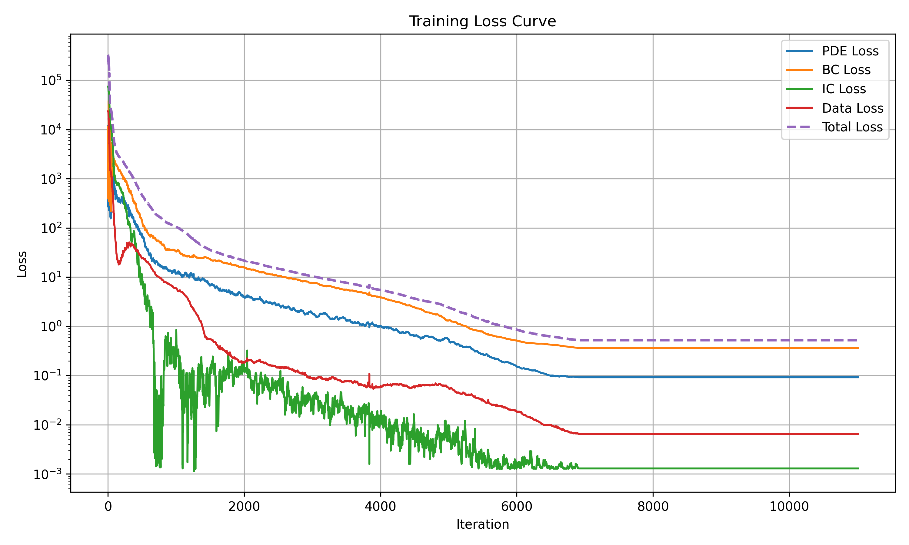

# 🚀 Pinnsformer：无太阳辐照工况下的卫星热传导建模

## 📌 项目简介

本项目基于 **PINNsformer** 架构，构建用于模拟在 **无太阳辐照条件下** 的 **卫星舱体时空温度演化过程**。通过引入 Transformer 的注意力机制，增强神经网络对 **长时间序列** 和 **空间耦合关系** 的建模能力，从而在传统 PINNs 框架上取得更强的表达能力与数值稳定性。

> **适用场景**：卫星处于地球阴影区、太阳能缺失时温度预测。防止电子器件低温失效，为热控系统设计提供数据基础。

---

## 🧊 物理背景：三维瞬态热传导

热传导主控方程如下：

$$
\frac{\partial T}{\partial t} = \frac{k}{\rho C_p} \left( \frac{\partial^2 T}{\partial x^2} + \frac{\partial^2 T}{\partial y^2} + \frac{\partial^2 T}{\partial z^2} \right)
$$

边界条件（无太阳辐照，无热源，仅热辐射）：

$$
-k\frac{\partial T}{\partial n} = \varepsilon \sigma \left(T_{\text{amb}}^4 - T^4 \right)
$$

初始条件：

$$
T(x, y, z, t=0) = T_0 = 273\text{K}
$$

---

## 🔧 技术要点

| 模块       | 描述 |
|------------|------|
| `PINNsformer` | 引入 Encoder-Decoder 结构处理时空序列特征，支持多头注意力机制和小波激活函数（WaveAct） |
| `train.py`    | 训练主控脚本，包含数据采样、物理损失组装、初始/边界条件处理等逻辑 |
| `utils.py`    | 网格采样与可视化工具类 |
| `Pinnsformer.py` | 模型定义，包括自定义编码器、解码器、小波激活函数等 |

---

## 📈 训练设置与超参数

```python
model = PINNsformer(d_out=1, d_hidden=512, d_model=64, N=1, heads=2)
k = 1       # 热导率
rho = 1     # 密度
C_p = 1     # 比热容
eps = 0.1   # 发射率
simga = 5.67e-8  # 斯特萊芙-伯尔兹曼常数
T_amb = 3       # 环境温度
T_0 = 273       # 初始温度
```


## 🔄 快速开始与训练流程

项目默认入口为 `train.py`，支持从零开始训练模型或加载已有 `.pt` 文件进行预测与可视化。你可以根据需要设定是否加载模型：

### ✅ 启动训练

```bash
python train.py
```

训练期间将自动保存模型到：

```
./model/3d_pinnsformer.pt
```

### ✅ 从已有模型加载并直接预测可视化

在 `train.py` 中设置：

```python
LOAD_MODEL = True
```

将跳过训练阶段，直接加载已有模型，执行预测和结果可视化。

---

### 🧮 输出日志（示例）

```
Iter 999 | PDE: 1.23e-04, BC: 3.45e-05, IC: 2.31e-06, Data: 4.56e-03, Total: 4.82e-02
Train Loss: 4.82e-02
relative L1 error: 0.0655
relative L2 error: 0.1472
```

训练过程中所有 loss 项会被保存到：

```
./viz/loss_curve.csv
```

---
## 📊 可视化分析结果

训练完成后，将自动生成以下图像文件，保存在 `./viz/` 目录下。以下为各类图像用途与示例路径说明：

---

### 📉 Loss Curve 可视化（从 CSV 载入）

你可以从训练保存的 `loss_curve.csv` 中重新生成 loss 曲线图：

```python
import pandas as pd
from utils import plot_loss_curve

# 从 CSV 读取 loss 数据
loss_df = pd.read_csv('./data/loss_curve.csv')

# 转为 numpy array（符合 plot_loss_curve 输入要求）
loss_track = loss_df.values  # shape: (N, 4)

# 绘图
plot_loss_curve(loss_track, save_path='./viz/loss_curve.png')
```

输出文件：

```
./viz/loss_curve.png
```
#### ✅ 示例图

<p align="center">
  
  <br/>
  <em>图示：训练过程中各损失项随迭代次数的变化（对数坐标）</em>
</p>

> 支持绘制每一轮训练中的 PDE / BC / IC / Data loss，以及综合 Total loss 的对数变化趋势。
### 🎞️ 温度演化 GIF 动画

```python
plot_temperature_animation(..., save_path='./viz/animation.gif')
```

生成文件：
```
./viz/animation.gif
```

<p align="center">
  
  <br/>
  <em>图示：PINNsformer 预测下的三维热场随时间变化</em>
</p>

---

### 🔥 误差随时间变化的空间动画

```python
plot_error_animation(..., save_path='./viz/error_animation.gif')
```

生成文件：
```
./viz/error_animation.gif
```

<p align="center">
  
  <br/>
  <em>图示：预测误差在三维空间随时间传播</em>
</p>

---

> 所有图像均支持替换 `save_path` 进行保存，便于论文插图或展示使用。

## 📂 项目结构

当前项目目录如下：

```
Pinnsformer/
├── data/
│   ├── data_rbc.txt           # 卫星热传导输入数据（空间坐标 + 时间 + T_true）
│   └── loss_curve.csv         # 训练过程中记录的 loss 数据
│
├── model/
│   ├── 3d_pinnsformer.pt      # 训练后的模型权重（PyTorch）
│   └── pinn.py                # 可选模型模块（如 PINN baseline）
│
├── scripts/
│   ├── Pinnsformer.py         # PINNsformer 模型结构定义（Encoder、Decoder、WaveAct）
│   └── utils.py               # 可视化函数与工具（loss 曲线 / GIF 动画 / 误差图等）
│
├── viz/
│   ├── animation.gif          # 模型预测的温度时空变化动画
│   ├── error_animation.gif    # 模型误差随时间演化动画
│   └── loss_curve.png         # Loss 曲线图（log scale）
│
├── train.py                   # 主训练脚本（支持训练 / 加载 / 可视化）
└── README.md                  # 项目说明文档（当前文件）
```

### 📌 文件说明摘要

| 路径 | 功能 |
|------|------|
| `data/` | 存放输入数据和训练过程记录 |
| `model/` | 保存模型参数文件 |
| `scripts/` | 模型结构与可视化工具 |
| `viz/` | 所有生成的图像与动画输出 |
| `train.py` | 项目主入口 |


## 🤝 贡献与许可证

恭喜您完成本项目的全部 Tutorial 学习！

您可以使用本文提供的模块化代码在您自己的研究或工程项目中运行各个模块，并根据实际需求进一步拓展如热源建模、多区域耦合、复杂边界等。

---

**贡献者：**

- Yuhao Ma  
---

**许可证：**

本文内容及代码版权归 **硒钼科技（北京）** 所有，禁止未经授权的商业用途或转载。

> 📎 更多信息请访问：[Science42 科技](https://www.science42.tech/#/index)
