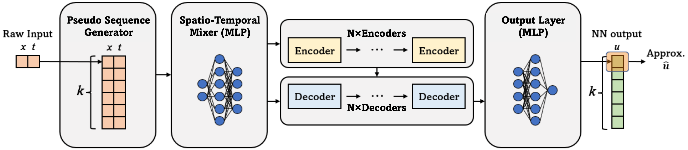
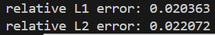

# PINNsformer用于求解三维固体传热问题

### PINNsformer模型示意图



## 问题描述

### 物理问题描述
固体传热是指热量通过固体传递的过程。在这个过程中，热量是通过固体传热以及辐射的方式进行的。

三维瞬态传热方程如下：

$$
\frac{\partial T}{\partial t}=\frac{k}{\rho C_\rho}(\frac{\partial^2T}{\partial x^2}+\frac{\partial^2T}{\partial y^2}+\frac{\partial^2T}{\partial z^2})
$$

## 边界条件:

边界热源条件：

$$
-\alpha(x,y,z)\frac{\partial T}{\partial n}=q(x,y,z,t)
$$

热辐射条件：

$$-k\frac{\partial T}{\partial n}\bigg|_ {\text{boundary}}=\varepsilon \sigma(T_ {\text{amb}}^4-T^4|_ {\text{boundary}})$$

初始条件：

$$
\left.T(x,y,z)\right|_{t=0} = 273
$$

## 导入所需要的包
本文件夹中的py文件是缺一不可得，所有的py文件的编写是基于pytorch框架。一共有三个py文件。
其中运行的主文件是train.py，其中包括设置物理损失和边界损失的程序，训练模型和测试训练结果;;
Pinnsformer.py是网络设置程序，使用全连接神经网络MLP和Transformer；
utils.py定义了采样及一些工具类;
需要的环境是python>=3.9, pytorch>=2.0;

## train.py

```python
import numpy as np
import pandas as pd
import torch
import torch.nn as nn
from torch.optim import LBFGS, Adam
from tqdm import tqdm
from utils import *
from Pinnsformer import PINNsformer
from matplotlib.animation import FuncAnimation, PillowWriter #导包
```

设备设置

```python
device = torch.device("cuda:1" if torch.cuda.is_available() else "cpu")
```

```python
for i in tqdm(range(25)):#设置循环次数
    def closure():
```
训练设置
```python
def init_weights(m):
    if isinstance(m, nn.Linear):
        torch.nn.init.xavier_uniform(m.weight)
        m.bias.data.fill_(0.01)
        
model = PINNsformer(d_out=1, d_hidden=512, d_model=64, N=1, heads=2).to(device)
model.apply(init_weights)
optim = LBFGS(model.parameters(), line_search_fn='strong_wolfe')
torch.save(model.state_dict(), './3d_pinnsformer.pt')
```
网格采样

```python
res = get_data([0, 1], [0, 1], [0, 1], [0, 1], 10, 10, 10, 6)
```

通过索引的方式简化了计算，避免了边界loss和初始loss的多次模型计算

```python
x0mask = [x_res[:,0,0] == 0]
x1mask = [x_res[:,0,0] == 1]
y0mask = [y_res[:,0,0] == 0]
y1mask = [y_res[:,0,0] == 1]
z0mask = [z_res[:,0,0] == 0]
z1mask = [z_res[:,0,0] == 1]
t0mask = [t_res[:, 0, 0] == 0]
        
ub_x0 = u_x[x0mask]
ub_x1 = u_x[x1mask]
ub_y0 = u_y[y0mask]
ub_y1 = u_y[y1mask]
ub_z0 = u_z[z0mask]
ub_z1 = u_z[z1mask]

pred_left = pred_res[x0mask]
pred_right = pred_res[x1mask]
pred_front = pred_res[y0mask]
pred_back = pred_res[y1mask]
pred_bottom = pred_res[z0mask]
pred_top = pred_res[z1mask]
pred_lb = pred_res[t0mask]
```

边界/初始条件

```python
loss_res = torch.mean((u_t - (k/(rho*C_p) * (u_xx + u_yy + u_zz))) ** 2) # PDE   

loss_bc1 = torch.mean((k * ub_x1 - q_sun) ** 2) # 太阳热源条件
loss_bc2 = torch.mean((eps * simga * (T_amb ** 4 - pred_left ** 4) + k * ub_x0) ** 2) # 热辐射条件
loss_bc3 = torch.mean((eps * simga * (T_amb ** 4 - pred_front ** 4) + k * ub_y0) ** 2)
loss_bc4 = torch.mean((eps * simga * (T_amb ** 4 - pred_back ** 4) - k * ub_y1) ** 2)
loss_bc5 = torch.mean((eps * simga * (T_amb ** 4 - pred_bottom ** 4) + k * ub_z0) ** 2)
loss_bc6 = torch.mean((eps * simga * (T_amb ** 4 - pred_top ** 4) - k * ub_z1) ** 2)
loss_bc = loss_bc1 + loss_bc2 + loss_bc3 + loss_bc4 + loss_bc5 + loss_bc6
loss_ic = torch.mean((pred_lb[:, 0] - 273) ** 2) # 初始条件
```

画图设置

```python
def loading_evaluate_data1(filename):
    ...
    return x, y, z, t, T

x, y, z, t, T = loading_evaluate_data1(filename)

t_steps = len(np.unique(t))
times = np.unique(t)

fig = plt.figure(figsize=(12,8))
ax1 = fig.add_subplot(121, projection='3d')
ax2 = fig.add_subplot(122, projection='3d')

scat1 = None  
scat2 = None  

def update(frame):
    ...

# 创建动画
anim = FuncAnimation(fig, update, frames=len(times), interval=100, blit=False)

# 保存为GIF
anim.save('animationsun.gif', writer=PillowWriter(fps=60))
```

其他注释见train.py文件

## utils.py

用于实现生成边界网格和PDE网格

导包

```python
import numpy as np
import torch.nn as nn
import copy
import matplotlib.pyplot as plt
import pandas as pd
```

生成网格res，res包含了边界点和内部PDE点

```python
def get_data(x_range, y_range, z_range, t_range, x_num, y_num, z_num, t_num):
    x = np.linspace(x_range[0], x_range[1], x_num)
    y = np.linspace(y_range[0], y_range[1], y_num)
    z = np.linspace(z_range[0], z_range[1], z_num)
    t = np.linspace(t_range[0], t_range[1], t_num)

    x_mesh, y_mesh, z_mesh, t_mesh = np.meshgrid(x, y, z, t)
    data = np.concatenate((np.expand_dims(x_mesh, -1), np.expand_dims(y_mesh, -1), np.expand_dims(z_mesh, -1),np.expand_dims(t_mesh, -1)), axis=-1)

    res = data.reshape(-1, 4)

    return res
```
其他注释见utils.py文件

## Pinnsformer.py

导包

```python
import torch
import torch.nn as nn
import pdb
from utils import get_clones
```

构建PINNsformer网络模型

```python
class PINNsformer(nn.Module):
    def __init__(self, d_out, d_model, d_hidden, N, heads):
        super(PINNsformer, self).__init__()

        self.linear_emb = nn.Linear(4, d_model)

        self.encoder = Encoder(d_model, N, heads)
        self.decoder = Decoder(d_model, N, heads)
        self.linear_out = nn.Sequential(*[
            nn.Linear(d_model, d_hidden),
            WaveAct(),
            nn.Linear(d_hidden, d_hidden),
            WaveAct(),
            nn.Linear(d_hidden, d_out)
        ])
```
```python
    def forward(self, x, y, z, t):
        src = torch.cat((x, y, z, t), dim=-1)
        src = self.linear_emb(src)

        e_outputs = self.encoder(src)
        d_output = self.decoder(src, e_outputs)
        output = self.linear_out(d_output)
        # pdb.set_trace()
        # raise Exception('stop')
        return output
```
构建Transformer网络模型

```python

class Encoder(nn.Module):
    def __init__(self, d_model, N, heads):
        ...

    def forward(self, x):
        ...

class Decoder(nn.Module):
    def __init__(self, d_model, N, heads):
        ...

    def forward(self, x, e_outputs):
        ...
```

定义小波函数（激活函数）

```python
class WaveAct(nn.Module):
    def __init__(self):
        super(WaveAct, self).__init__()
        self.w1 = nn.Parameter(torch.ones(1), requires_grad=True)
        self.w2 = nn.Parameter(torch.ones(1), requires_grad=True)

    def forward(self, x):
        return self.w1 * torch.sin(x) + self.w2 * torch.cos(x)
```

## PINNsformer功能介绍

### 参数的设置

PINNsformer的参数设置主要是通过train.py文件进行实现，这其中包括材料参数的设置，神经网络相关参数

```python
#模型设置
model = PINNsformer(d_out=1, d_hidden=512, d_model=64, N=1, heads=2).to(device)
# d_out=1 输出预测值数量
# d_hidden=512 Transformer隐藏层神经元数量
# d_model=64 MLP隐藏层层数
# N=1 深拷贝，用于模型并行，设置为1相当于没有使用
# heads=2 MultiheadAttention设置参数，多头注意力机制中并行计算的注意力头的数量    
# 材料参数
    k = 1 # 热导率
    rho = 1 # 密度
    C_p = 1 # 比热容
    eps = 0.1 #发射率
    simga = 5.67e-8 # 斯特藩-玻尔兹曼常数
    T_amb = 3 # 环境温度
    T_0 = 273
    q_sun = 400 # 边界热源
```

## 结果展示




